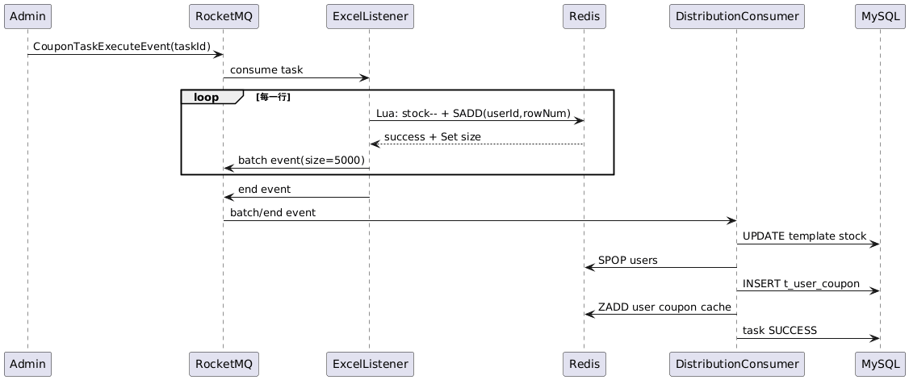
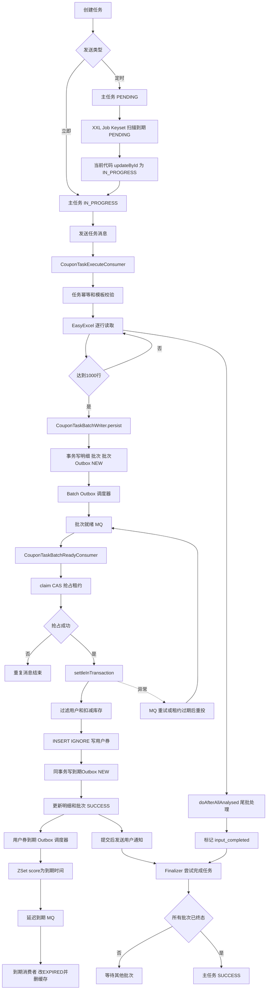
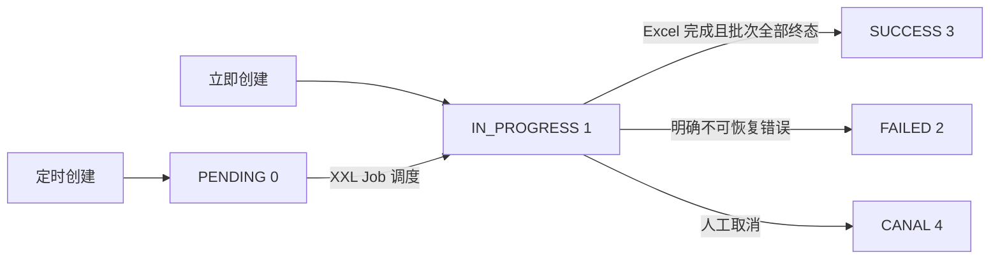
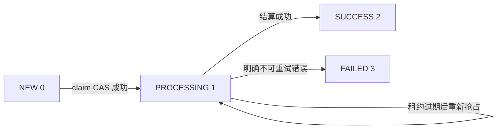
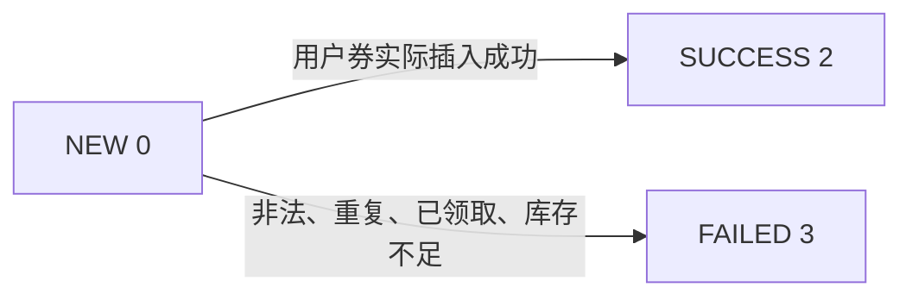
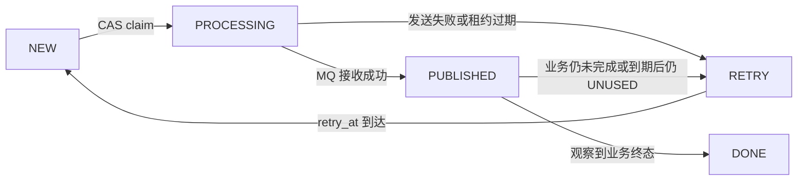
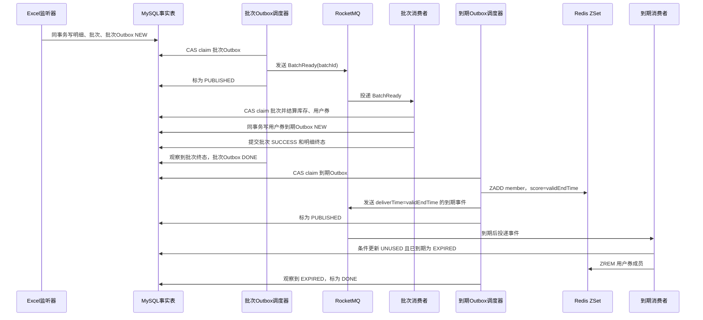

# 优惠券分发优化设计与可靠性说明

> 本文与当前代码一起阅读。旧的 Redis Set/Lua 分发链、Canal 用户券缓存投影和批次恢复 Job 已从当前链路移除；当前链路由 `DurableCouponTaskExcelListener`、两个 Outbox 调度器、`CouponTaskBatchReadyConsumer`、`CouponTaskBatchSettlementService` 和 `UserCouponDelayCloseConsumer` 组成。预测压测数字是容量模型，不是本地已实测结果。

## 一、优化前方案

### 1. 流程

1. 商户创建 `t_coupon_task`，立即任务发送 `CouponTaskExecuteEvent`。
2. `CouponTaskExecuteConsumer` 使用 EasyExcel 流式读取文件。
3. `ReadExcelDistributionListener` 每行执行 Redis Lua：模板库存减一，用户/行号写入任务 Set，并保存 Redis 解析进度。
4. Set 到 5000 条发送 `CouponTemplateDistributionEvent`；Excel 完成后再发送结束事件。
5. `CouponExecuteDistributionConsumer` 先条件扣减 MySQL 模板库存，再 `SPOP` Redis Set，批量插入 `t_user_coupon`。
6. 写用户券 Redis ZSet、导出失败 Excel、把任务改为 `SUCCESS`。

### 2. 优化前时序图



### 3. 优化前的主要漏洞

| 问题 | 故障序列 | 后果 |
|---|---|---|
| `SPOP` 先于数据库提交 | `SPOP` 成功 → MySQL 超时/回滚 → 进程退出 | 用户从唯一待处理集合消失，漏发 |
| Redis 预扣与 MySQL 库存双写 | Redis 已减、MySQL 未减，或反向 | 两套库存不一致，补偿困难 |
| Set 成员包含 `rowNum` | 同一用户出现在两行 | 预扣两份库存，最后靠唯一键失败，库存可能被错误占用 |
| 批次没有持久化状态 | 重复消息、结束消息先到、消费者崩溃 | 无法判断该批次是否已经结算 |
| 13 位位压缩长度上限 | Set 长度超过可表示范围 | 批量阈值判断溢出 |
| Redis Key 依赖格式字符串 | 前缀常量与 `String.format` 混用 | 可能写入错误用户券缓存键 |
| 普通本地事务跨分片 | 模板在 shop 分片、用户券在 user 分片 | `@Transactional` 不能证明跨库原子提交 |

## 二、优化后方案

### 1. 核心组件

- `t_coupon_task_item`：一行 Excel 的持久化快照，唯一键 `(task_id,row_num)`。
- `t_coupon_task_batch`：可重试批次，唯一键 `(task_id,batch_no)`，包含 `NEW/PROCESSING/SUCCESS/FAILED` 和租约字段。
- `DurableCouponTaskExcelListener`：每 1000 行调用 `CouponTaskBatchWriter`，只负责持久化明细、批次和批次 Outbox，不直接发送 MQ。
- `CouponTaskBatchOutboxDispatcher`：扫描 `t_coupon_task_batch_outbox`，租约抢占后可靠投递 `CouponTaskBatchReadyEvent`。
- `CouponTaskBatchReadyConsumer`：只信任 `batchId`，不信任消息中的用户列表或库存数字。
- `CouponTaskBatchSettlementService`：数据库 CAS 抢占、重复用户过滤、条件扣库存、`INSERT IGNORE` 用户券、明细/批次终态推进。
- `UserCouponExpireOutboxDO`：和 `t_user_coupon` 同事务记录用户券到期事件，保存用户 ID、券 ID、模板 ID 和 `valid_end_time`。
- `UserCouponExpireOutboxDispatcher`：将到期 Outbox 投影到 Redis ZSet（score=`valid_end_time`），并发送 RocketMQ 延迟到期事件。
- `UserCouponDelayCloseConsumer`：使用事件中的用户 ID，幂等删除 Redis 成员，并用条件更新把数据库状态改为 `EXPIRED`。
- Redis：只做用户券列表查询投影；查询通过 ZSet score 过滤过期成员，不回源数据库作为正常路径。
- 失败原因写入与批次同库的 `t_coupon_task_item.fail_reason`；失败 Excel 应由独立导出任务读取这份持久化失败源生成，不能再从 Redis Set 里 `SPOP` 后临时拼装。旧的 `t_coupon_task_fail` 不再参与结算事务，避免把核心事务重新拉成跨库写。

### 2. 新流程

1. 任务消息到达后，EasyExcel 逐行读取。
2. 每 1000 行在本地事务中写入任务明细、批次和 `t_coupon_task_batch_outbox`；事务提交后由 Outbox 调度器发送 `CouponTaskBatchReadyEvent(batchId)`。
3. MQ 重复、并发实例或 Outbox 补投都执行 `UPDATE ... WHERE status=NEW OR lease_expire_time<NOW()`，只有影响行数为 1 的实例获得租约。
4. 获得租约的实例读取 `NEW` 明细，先在当前批次内按用户去重，再查询已领取用户。
5. 根据数据库库存快照计算候选数量，使用 `stock >= N` 条件更新进行真实库存预留。
6. 批量 `INSERT IGNORE t_user_coupon`；再按本次生成的雪花券 ID查询实际写入集合，将并发唯一键冲突的预留库存归还。
7. 成功明细写入 `coupon_id` 并标记 `SUCCESS`，失败明细写入原因并标记 `FAILED`，批次标记 `SUCCESS`。
8. 用户券写入的同一事务同时写 `t_user_coupon_expire_outbox`；Outbox 调度器负责写入 Redis ZSet（score=`valid_end_time`）并发送延迟到期事件。通知仍在数据库提交后发送。
9. 输入完成字段 `input_completed=1` 且任务没有 `NEW/PROCESSING` 批次时，任务才标记 `SUCCESS`。

### 3. 一条不绕的实际执行链

下面按“谁调用谁、做了什么、状态如何变化”展开。阅读代码时按这个顺序即可，不要一开始在 Redis、MQ 和多个消费者之间来回跳转。

#### 第 0 步：创建主任务

入口是 `CouponTaskServiceImpl.createCouponTask`：

1. 写入 `t_coupon_task`，生成任务主键和批次标识。
2. 立即发送任务：主任务状态直接是 `IN_PROGRESS(1)`，随后发送 `CouponTaskExecuteEvent`。
3. 定时发送任务：主任务状态是 `PENDING(0)`，等待 `CouponTaskJobHandler.execute` 扫描。
4. 异步统计 Excel 总行数，写入主任务 `send_num`；这不是发券主链路的前置条件。

> 当前代码核对结果：`CouponTaskJobHandler.distributeCoupon` 仍然是“查询 `PENDING` 后调用 `updateById`”，调度层尚未使用条件 CAS。批次消费层的 `CouponTaskBatchMapper.claim` 才是已经落地的租约 CAS。若多个 XXL-Job 实例并发执行，调度层仍建议改为 `UPDATE ... WHERE status=0 AND send_time<=NOW()`，只有影响行数为 1 才发送任务 MQ。

#### 第 1 步：任务消息进入分发服务

`CouponTaskExecuteConsumer.onMessage`：

1. `@NoMQDuplicateConsume` 以 `couponTaskId` 做任务级消费幂等。
2. 查询 `t_coupon_task`，要求主任务状态为 `IN_PROGRESS(1)`。
3. 查询优惠券模板，要求模板状态为 `ACTIVE`。
4. 调用 `EasyExcel.read(...).sheet().doRead()`，进入 `DurableCouponTaskExcelListener`。

任务级幂等只负责避免同一个 Excel 被多个消费者同时完整解析；真正的明细和批次幂等仍由数据库唯一键保证。

#### 第 2 步：Excel 按行解析并持久化批次

`DurableCouponTaskExcelListener.invoke` 每读取一行就放入内存缓冲区；累计 1000 行后调用 `flush(false)`。

`flush` 调用 `CouponTaskBatchWriter.persist`，在一个本地数据库事务中完成：

1. 用 `(task_id,batch_no)` 查询是否已经存在批次。
2. 为每一行生成 `task_item.id`，写入 `t_coupon_task_item`，明细初始状态为 `NEW(0)`。
3. 生成 `batch.id`，写入 `t_coupon_task_batch`，批次初始状态为 `NEW(0)`。
4. 写入 `t_coupon_task_batch_outbox`，初始状态为 `NEW`，与明细、批次一起提交。

事务提交后，`CouponTaskBatchOutboxDispatcher` 扫描 Outbox、以租约抢占事件，再发送 `CouponTaskBatchReadyEvent(batchId)`。如果 MQ 发送失败、结果未知或调度实例宕机，Outbox 会回到 `RETRY` 并指数退避重试；批次消费者的 CAS 能处理消息重复。

#### 第 3 步：消费批次并抢占租约

`CouponTaskBatchReadyConsumer.onMessage` 调用 `CouponTaskBatchSettlementService.claimAndSettle`。

`CouponTaskBatchMapper.claim` 执行 CAS：

```sql
UPDATE t_coupon_task_batch
SET status = 1,
    lease_owner = :owner,
    lease_expire_time = :expireTime
WHERE id = :batchId
  AND shop_number = :shopNumber
  AND (status = 0 OR (status = 1 AND lease_expire_time < NOW()));
```

影响行数为 1：当前实例获得处理权，批次变为 `PROCESSING(1)`；影响行数为 0：说明已经被其他实例处理或已经是终态，本次重复消息直接结束。

#### 第 4 步：数据库事务内结算

抢占成功后进入 `CouponTaskBatchSettlementService.settleInTransaction`：

1. `selectForUpdate` 锁定当前批次，并校验 `status=PROCESSING` 且 `lease_owner` 仍是当前实例。
2. 查询该批次所有 `NEW` 明细。
3. 解析用户 ID，过滤非法用户、Excel 内重复用户、数据库中已经领取过该模板的用户。
4. 使用 `stock >= N` 条件更新扣减模板真实库存。
5. 使用 `INSERT IGNORE` 批量写入 `t_user_coupon`。
6. 根据实际插入的优惠券 ID，归还没有成功写入的预留库存。
7. 成功明细更新为 `SUCCESS(2)`，失败明细更新为 `FAILED(3)` 并记录原因。
8. 统计成功数和失败数，调用 `markSuccess`，批次变为 `SUCCESS(2)`。

如果中途异常，整个本地事务回滚，批次暂时保留 `PROCESSING(1)`；RocketMQ 会重试。消费者进程在租约内宕机时，Broker 重投或之后的重复消息都能在租约到期后再次 claim。只有明确不可重试并经过策略判定时，才应把批次置为 `FAILED(3)`。

#### 第 5 步：用户券到期 Outbox、Redis 投影和到期收敛

成功用户券与 `t_user_coupon_expire_outbox` 在同一个用户分片本地事务内写入。Outbox 事件包含 `userCouponId`、`userId`、`couponTemplateId` 与 `validEndTime`。

1. `UserCouponExpireOutboxDispatcher` 将用户券写入 Redis ZSet；member 为 `{templateId}_{userCouponId}`，score 为 `validEndTime` 毫秒值。
2. 调度器发送以 `validEndTime` 为交付时间的 `UserCouponDelayCloseEvent`。
3. 到期时，`UserCouponDelayCloseConsumer` 使用 `status=UNUSED AND valid_end_time<=NOW()` 条件更新为 `EXPIRED`，然后删除 Redis 成员；两步均可重复执行。若事件提前到达，消费者直接确认且不删缓存，PUBLISHED 观察轮次会在到期后重新置为 `RETRY` 补投。
4. 结算服务查询用户券不访问 MySQL，而是 `ZRANGEBYSCORE key (now,+inf)`，因此即使到期 MQ 暂时堆积，过期券也不会被返回。

用户通知仍由 `registerPostCommitNotifications` 在提交后发送；通知失败不回滚用户券，与缓存/到期 Outbox 的可靠性边界分开。

#### 第 6 步：尝试关闭主任务

批次消费者处理完成后调用 `CouponTaskFinalizer.tryFinish(taskId, shopNumber)`；Excel 读完后，监听器的 `doAfterAllAnalysed` 也会调用一次。

只有同时满足以下条件，主任务才从 `IN_PROGRESS(1)` 变为 `SUCCESS(3)`：

```text
input_completed = 1
且该任务不存在 NEW(0) 或 PROCESSING(1) 批次
```

因此，结束事件乱序、批次 MQ 重复或最后一批延迟，都不会导致任务提前成功。

### 4. 总体流程图



### 5. 状态流转图

#### 主任务 `t_coupon_task`



主任务状态值为：`PENDING=0`、`IN_PROGRESS=1`、`FAILED=2`、`SUCCESS=3`、`CANAL=4`。

#### 批次 `t_coupon_task_batch`



批次状态值为：`NEW=0`、`PROCESSING=1`、`SUCCESS=2`、`FAILED=3`。`PROCESSING` 必须同时有 `lease_owner` 和 `lease_expire_time`。

#### 单行明细 `t_coupon_task_item`



#### 两类 Outbox



`PUBLISHED` 的含义不是“业务已完成”，而是“MQ 已接受一次投递、仍需观察”。批次 Outbox 观察批次是否为 `SUCCESS/FAILED`；用户券到期 Outbox 观察用户券是否为 `EXPIRED/USED/REVOKED`。这避免了“发送成功但消费者组宕机”时事件被过早标记为完成。

### 6. 中文时序图



> 查询路径只执行 `ZRANGEBYSCORE (now,+inf)`，不回源 MySQL；即使延迟事件丢失，过期 score 也不会返回给用户，到期 Outbox 会在到期后补投并最终清理数据库与 Redis。

## 三、为什么这样设计

### 1. 为什么不用 Redis Set 做唯一待处理数据

Redis Set 适合高速临时集合，不适合作为“不能丢”的任务事实。新方案把 Excel 行先落库，MQ 丢消息只影响唤醒，不影响数据本身；与批次同事务的 Outbox 会持续补投唤醒消息。这样解决了 `SPOP` 后数据库失败造成的漏发。

### 2. 为什么批次必须有租约

仅仅把批次改成 `PROCESSING` 不够：实例在改状态后宕机，批次会永久卡死。`lease_owner + lease_expire_time` 允许其他实例接管过期批次；owner 条件又防止旧实例恢复后覆盖新实例。

### 3. 为什么库存以 MySQL 条件更新为最终裁决

Redis 预扣不能与 MySQL 用户券表形成原子事务。最终库存只允许由：

```sql
UPDATE t_coupon_template
SET stock = stock - :n
WHERE shop_number = :shopNumber
  AND id = :templateId
  AND stock >= :n;
```

影响行数为 1 的操作获得库存。多实例并发时 InnoDB 行锁保证不会把库存减成负数；`INSERT IGNORE` 后按实际写入数归还差额，避免重复用户造成永久少扣。

### 4. 为什么 Redis 放到 afterCommit

Redis 是读模型，不是事实库。先写 Redis 再写 MySQL 会产生“缓存有券、数据库没券”；先写 MySQL 再写 Redis 即使 Redis 暂时失败，也可以通过缓存重建补回，不会丢发放事实。

### 5. 为什么任务完成不能由 End MQ 决定

RocketMQ 不保证两个业务事件按业务语义先后到达。新方案只检查两个持久化条件：`input_completed=1` 且不存在 `NEW/PROCESSING` 批次，结束事件即使乱序也只会触发一次无害检查。

## 四、批次大小和其他常量如何得出

### 1. `DISTRIBUTION_BATCH_SIZE = 1000`

批次大小在吞吐、锁持有时间、单次失败重试成本之间取平衡。设：

- 单行用户券写入及索引平均成本为 `t_row`；
- 事务固定开销为 `t_fixed`；
- 允许的单事务目标时长为 `T_target`；
- 允许一次故障最多重放 `R_retry` 行。

可用估算：

```text
B <= (T_target - t_fixed) / t_row
B <= R_retry
```

旧值 5000 行在索引、跨分片和锁竞争时容易把一次重试放大到 5000 行；首版取 1000，是为了把单批回滚/租约超时成本控制在可接受范围。上线压测后按 p95 事务时长调整：若 p95 < 1s 且数据库 CPU/IO 有余量，可升到 2000；若 p95 > 3s 或锁等待明显，应降到 500。

### 2. 租约 120 秒

租约至少覆盖：数据库最慢批次 p99 + GC 暂停 + 网络重试。若 1000 行批次 p99 为 8 秒，120 秒约为 15 倍安全余量；若监控发现批次可能超过 60 秒，必须延长租约或拆小批次，并在代码中增加续租，而不是盲目提高超时。

### 3. Outbox 扫描页 100

Outbox 是低频可靠投递器，不应抢占正常消费者连接。100 条每轮足以快速发现 `NEW/RETRY` 事件，同时限制一次扫描的 MQ 突发。查询按 `(status, retry_at, id)` 索引筛选就绪事件，不再从批次表 `lastId=0` 或 `id > lastId` 全量扫描；这也避免了 `LIMIT 100000,100` 跳过前 100000 行的 OFFSET 成本。

## 五、预测压测结果（非实测）

以下是用于制定压测目标的模型，不代表当前机器已经达到这些数字：

| 场景 | 假设 | 预测结果 |
|---|---|---|
| 单实例基线 | 1000 行/批，批内无重复，单库 SSD，4 个消费者线程 | 约 8～20 批/秒，即 8k～20k 行/秒 |
| 4 实例水平扩展 | 16 个消费者线程，模板库存热点可接受 | 约 25k～60k 行/秒；热点模板行锁会成为主要上限 |
| 1,000,000 行 | 按 20k 行/秒理想模型 | 约 50 秒纯处理时间；考虑 Excel IO、索引、MQ、GC、重试，工程预期 2～6 分钟 |
| 库存不足 | 早期批次耗尽库存 | 后续批次只更新失败明细，用户券写入量不再随输入量增长 |

容量不能只看“事务 QPS”：批次事务 QPS 约为 `行速率 / 批次大小`，但 MySQL 仍需写入相同数量的明细、用户券、索引和 binlog。正式压测必须记录：模板行锁等待、用户券各分片 QPS、redo/binlog fsync、连接池活跃数、MQ 堆积、批次 p95/p99、失败重试率和 Redis 投影延迟。

## 六、为什么能做到不漏发、不多发

### 不漏发保护

1. Excel 行先持久化；Redis 丢失不会丢待处理数据。
2. 批次、明细和 `BATCH_READY` Outbox 同事务提交；MQ 失败/发送结果未知由 Outbox 重试补投。
3. Outbox 发送成功后先保持 `PUBLISHED`，只有观察到批次终态才置 `DONE`；消费者组异常、Broker 重试耗尽或租约到期时仍会重新唤醒。
4. 批次只要还有 `NEW/PROCESSING`，任务不会提前 SUCCESS。
5. 用户券写入失败时事务回滚或批次重试，明细仍保留原始行号。

### 不多发保护

1. `(task_id,row_num)` 防止 Excel 重放插入重复明细。
2. `(task_id,batch_no)` 防止重复解析创建重复批次。
3. 批次 CAS 防止多个消费者同时结算同一批次。
4. 当前批次内按 userId 去重，已在数据库领取过的用户被标记失败。
5. `t_user_coupon` 唯一键是跨实例/跨业务入口的最后防线。
6. 库存扣减使用 `stock >= N` 条件，实际成功数不足时归还预留差额。

## 七、仍然存在的边界与上线前必须补齐的工作

- 新增迁移 `V20260824__coupon_expire_and_distribution_outbox.sql` 必须分别在 `one_coupon_0`、`one_coupon_1` 执行；上线前先灰度确认 Outbox 的 `NEW/RETRY/PUBLISHED/DONE` 指标正常，再删除旧消费者组。
- 模板表按 `shop_number` 分片、用户券表按 `user_id` 分片。代码让 `t_user_coupon_expire_outbox` 与用户券按相同 `user_id` 路由，因此单用户券和到期 Outbox 可落到同一物理分片；但一个 1000 行分发批次仍可能跨多个用户分片和模板分片。当前普通 `TransactionTemplate` 不是跨库 XA，若要把“库存、全部用户券、全部 Outbox”作为强原子整体，生产必须启用 XA/Seata，或按用户分片拆分为可对账子事务。
- Redis ZSet 是高性能读模型：score 是 `validEndTime`，查询只读 Redis 并过滤 score；延迟事件负责物理删除和 MySQL 状态收敛。Redis 物理清理失败不会使过期券重新可见；提前到达的延迟事件不会删除未到期成员。
- 通知仍在 afterCommit 发送，失败只影响通知，不影响发券、缓存或到期状态；需要独立通知 Outbox 才能达到与到期事件同等级的可证明可靠性。

## 八、建议压测与故障演练矩阵

1. 1 万、10 万、100 万行，重复用户比例 0%、10%、50%。
2. 库存分别为输入量的 120%、100%、50%。
3. MQ 重复投递、消息发送超时、批次消费者在扣库存前/后/提交前强杀。
4. Redis 关闭、MySQL 单分片延迟、模板行锁竞争、连接池耗尽。
5. 验证最终账：`成功明细数 = 用户券数 = 模板初始库存 - 当前库存 - 可归还差额`，失败明细行号无重复，任务只有在所有批次终态后成功。
