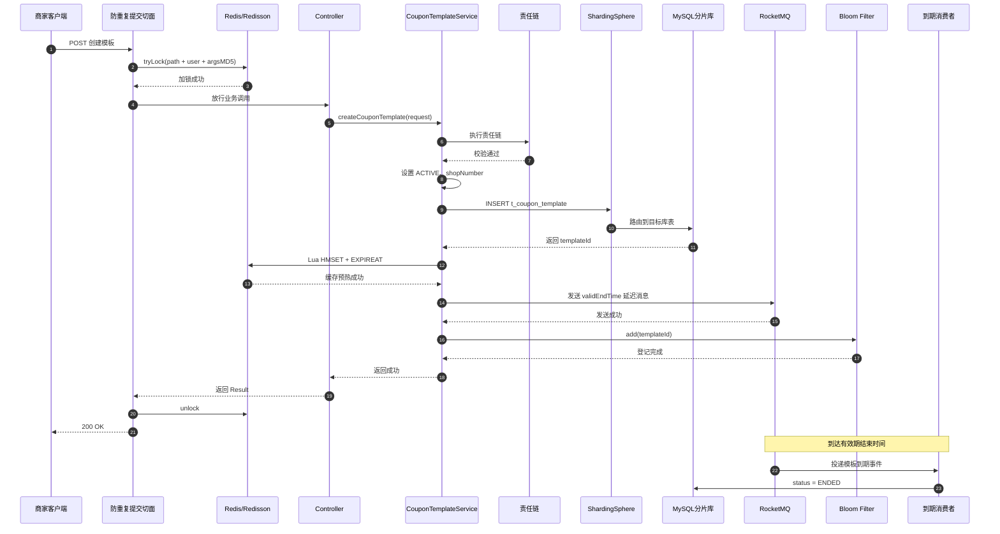
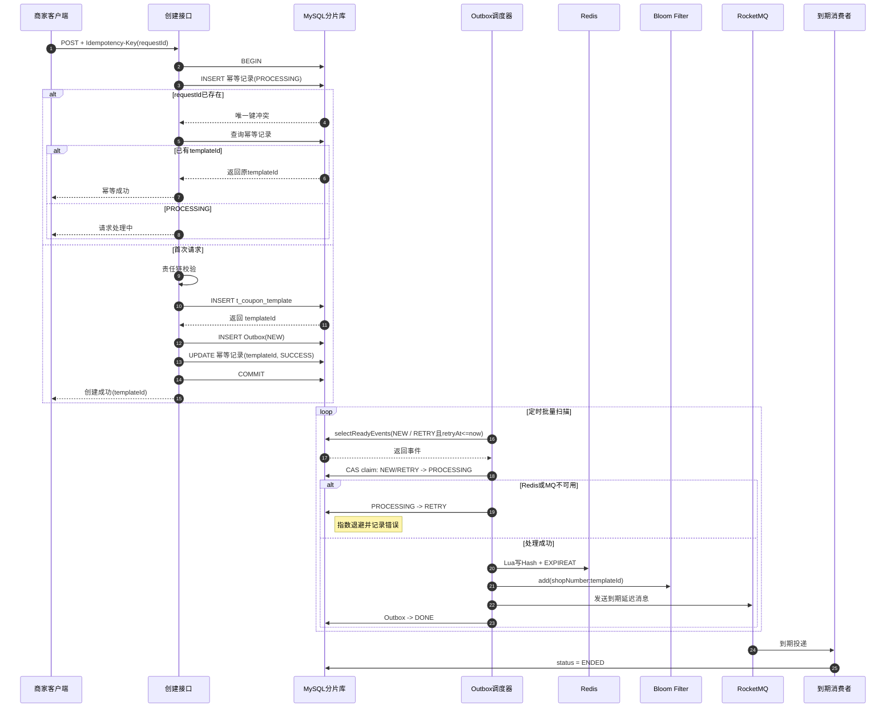

# 优惠券模板创建流程笔记

> 本笔记区分两套方案：
>
> - **优化前实现**：同步执行 MySQL、Redis、RocketMQ、Bloom。
> - **当前优化实现**：MySQL 事务 + 幂等请求表 + Outbox + 异步补偿。
>
> 当前代码已将创建接口改造成 Outbox 链路；执行数据库迁移后生效。

## 一、当前仓库的入口

接口：

```http
POST /api/merchant-admin/coupon-template/create
Idempotency-Key: 6d2cf7c1-1f75-4e2b-b6a3-9d72a5e6e1aa
```

接口返回创建成功的 `templateId`；客户端网络重试时必须复用同一个 `Idempotency-Key`。

主要代码：

- `merchant-admin/src/main/java/com/nageoffer/onecoupon/merchant/admin/controller/CouponTemplateController.java`
- `merchant-admin/src/main/java/com/nageoffer/onecoupon/merchant/admin/service/impl/CouponTemplateServiceImpl.java`
- `merchant-admin/src/main/java/com/nageoffer/onecoupon/merchant/admin/dto/req/CouponTemplateSaveReqDTO.java`

## 二、优化前同步创建链路

```text
客户端
  -> @NoDuplicateSubmit 防重复提交
  -> CouponTemplateController
  -> CouponTemplateServiceImpl
  -> 责任链校验
  -> MySQL：插入 t_coupon_template
  -> Redis：Lua 写模板 Hash + EXPIREAT
  -> RocketMQ：发送模板到期延迟消息
  -> Bloom Filter：登记 templateId
  -> 返回成功
```

### 1. 防重复提交

控制器创建方法标注：

```java
@NoDuplicateSubmit(message = "请勿短时间内重复提交优惠券模板")
```

框架切面使用“请求路径 + 当前用户 ID + 请求参数 MD5”生成 Redisson 锁 Key。获取锁失败就认为是重复提交。

当前限制：它依赖 Redis/Redisson，Redis 宕机时可能在进入业务方法前失败。

### 2. 责任链校验

服务调用：

```java
merchantAdminChainContext.handler(
        MERCHANT_ADMIN_CREATE_COUPON_TEMPLATE_KEY.name(),
        requestParam
);
```

当前处理器：

| 顺序 | 处理器 | 主要职责 |
|---:|---|---|
| 0 | CouponTemplateCreateParamNotNullChainFilter | 必填校验 |
| 10 | CouponTemplateCreateParamBaseVerifyChainFilter | 枚举、商品组合、库存、规则 JSON 校验 |
| 20 | CouponTemplateCreateParamVerifyChainFilter | 商品中心、外部业务校验扩展点，当前仍有 TODO |

责任链在启动时自动收集 Spring Bean，按 `mark()` 分组，再按 `Ordered#getOrder()` 排序。因此新增校验器不需要修改创建主方法。

### 3. 组装并写入数据库

```java
CouponTemplateDO couponTemplateDO =
        BeanUtil.toBean(requestParam, CouponTemplateDO.class);
couponTemplateDO.setStatus(CouponTemplateStatusEnum.ACTIVE.getStatus());
couponTemplateDO.setShopNumber(UserContext.getShopNumber());
couponTemplateMapper.insert(couponTemplateDO);
```

关键点：

- `status` 由服务端设置，不能信任客户端。
- `shopNumber` 从用户上下文获取，用于数据权限和分片路由。
- MyBatis-Plus 自动填充创建时间、更新时间和删除标识。
- `t_coupon_template` 是逻辑表，实际由 ShardingSphere 路由到物理表。

### 4. 分库分表

模板按 `shop_number` 水平分库分表：

```text
one_coupon_0.t_coupon_template_0 ~ t_coupon_template_15
one_coupon_1.t_coupon_template_0 ~ t_coupon_template_15
```

共 2 个库、每库 16 张表、32 张物理表。店铺号哈希后决定库表。

这样做是因为后台最常见的查询带店铺号，可以精准路由，避免全库广播查询。

### 5. Redis 缓存预热

模板插入后拿到数据库生成的 `templateId`，写入 Redis Hash：

```text
one-coupon_engine:template:{templateId}
```

Lua 脚本：

```lua
redis.call('HMSET', KEYS[1], unpack(ARGV, 1, #ARGV - 1))
redis.call('EXPIREAT', KEYS[1], ARGV[#ARGV])
```

最后一个参数是 `validEndTime` 的 Unix 秒时间戳。Lua 将 Hash 写入和设置过期时间合并为原子操作，避免缓存写入成功但 TTL 设置失败。

### 6. RocketMQ 延迟消息

创建时发送 `CouponTemplateDelayEvent`：

```java
CouponTemplateDelayEvent event = CouponTemplateDelayEvent.builder()
        .shopNumber(UserContext.getShopNumber())
        .couponTemplateId(couponTemplateDO.getId())
        .delayTime(couponTemplateDO.getValidEndTime().getTime())
        .build();
```

到达 `validEndTime` 后，消费者按 `shopNumber + couponTemplateId` 更新模板状态为 `ENDED`。

延迟消息避免了定时任务高频扫描所有模板表。

### 7. Bloom Filter

创建成功后登记：

```java
couponTemplateQueryBloomFilter.add(
        String.valueOf(couponTemplateDO.getId())
);
```

引擎查询缓存未命中时先判断 Bloom：

- `false`：一定不存在，可以快速拒绝。
- `true`：可能存在，仍需查询缓存或数据库。

它主要用于防止随机无效模板 ID 穿透 Redis，打到分片 MySQL。

## 三、当前方案时序图



## 四、当前实现的一致性问题

当前顺序是：

```text
MySQL 成功 -> Redis 成功 -> MQ 成功 -> Bloom 成功
```

它们不在同一个事务中，可能出现：

### Redis 成功、MQ 失败

- DB 中模板仍然是 `ACTIVE`。
- Redis 到期后删除缓存。
- MQ 没有消费者更新 DB 状态。
- 用户回源数据库时，可能查到过期模板。

所以查询数据库时必须同时判断：

```java
.eq(CouponTemplateDO::getStatus, ACTIVE)
.le(CouponTemplateDO::getValidStartTime, now)
.gt(CouponTemplateDO::getValidEndTime, now)
```

MQ 只是及时推进状态，不能作为判断模板有效性的唯一依据。

### Bloom 丢失

Redis 重启、淘汰或手工删除后，Bloom 可能为空。真实模板会被 `contains=false` 错误拦截。

解决办法：

- Bloom 增加 `BUILDING/READY` 就绪状态。
- 未就绪时不能用 `false` 直接拒绝，应限流后回源数据库。
- Redis 恢复后按分片扫描有效模板重建 Bloom。

## 五、优化前可能产生的问题：为什么要改造

### 1. 多个中间件的部分成功无法由 `@Transactional` 回滚

优化前创建顺序为 `MySQL -> Redis -> RocketMQ -> Bloom`。`@Transactional` 最多只能管理当前 MySQL 数据源，不能让 Redis 命令和 RocketMQ 发送与数据库提交成为一个原子操作。

典型故障：MySQL、Redis 成功后 MQ 投递失败。缓存到期后被删除，但数据库状态仍可能是 `ACTIVE`；如果查询只依赖状态而不校验时间，过期券会重新从数据库被查出。

### 2. 创建请求重试会生成多张模板

`@NoDuplicateSubmit` 的本质是 Redis 锁：它只覆盖一小段时间，并且 Redis 故障时可能连入口都无法进入。网络超时后客户端重试、进程重启或锁过期都可能再次执行插入，不能提供“同一个业务请求永远只创建一张券”的语义。

### 3. Redis/Bloom/MQ 不可用会拖垮后台建券

同步写缓存、Bloom 和 MQ 任一失败都会让接口报错，但 MySQL 模板可能已经落库。用户看到失败后重试会放大重复创建和不一致问题；Redis 宕机时，原先的 Redisson 防重复提交还会成为创建链路的单点依赖。

### 4. Outbox 处理需要防并发、可恢复

单纯“定时扫描未发送消息”仍会遇到多实例重复消费、实例在发送后宕机、任务长期卡在处理中等问题。因此需要 `NEW/PROCESSING/RETRY/DONE` 状态、租约、CAS 抢占和指数退避。即使 MQ 出现“已发送但还未来得及置 DONE”的窗口，也必须允许消息重复；消费者的状态更新必须是幂等的。

### 5. Bloom 是派生索引，可能假阴性且不能在线扩容

Bloom 不在 MySQL 中。Redis 重启、淘汰或手工删除后，`contains=false` 可能误伤真实模板；并且 `tryInit` 不会修改已存在 Bloom 的容量和误判率。因此生产需要版本化 Key、启动/恢复时按分片回灌有效模板，并且在 `BUILDING` 状态下禁用 Bloom 的“false 直接拒绝”能力，改为受控回源数据库。

当前代码已将 Bloom Key 改为 `couponTemplateQueryBloomFilter:{version}`，并把容量、误判率和 `ready` 配置化；`ready=false`（默认）时引擎不因 Bloom 返回 `false` 直接拒绝。全量回灌完成后，将商家后管和引擎的 `version` 对齐并把引擎 `ready` 设为 `true`。

## 六、当前优化后的实现

把数据分成：

```text
强一致事实：MySQL 中的券模板
派生数据：Redis Hash、Bloom、RocketMQ 到期消息
```

创建接口在同一 MySQL 事务中写：

1. 幂等请求记录。
2. `t_coupon_template` 模板记录。
3. Outbox 事件记录。

事务提交后，`CouponTemplateOutboxDispatcher` 异步处理 Redis、Bloom 和 RocketMQ。实现文件：

- `merchant-admin/.../CouponTemplateServiceImpl.java`
- `merchant-admin/.../service/outbox/CouponTemplateOutboxDispatcher.java`
- `merchant-admin/.../resources/mapper/CouponTemplateReliabilityMapper.xml`
- `merchant-admin/resources/database/onecoupon-template-reliability.sql`

### 当前链路

```text
客户端携带 requestId
  -> BEGIN MySQL事务
  -> 插入幂等记录(PROCESSING)
  -> 责任链校验
  -> 插入 t_coupon_template
  -> 插入 Outbox(TEMPLATE_CREATED, NEW)
  -> 幂等记录绑定 templateId 并置 SUCCESS
  -> COMMIT
  -> 返回 templateId

Outbox调度器
  -> 查询 NEW 或到重试时间的 RETRY
  -> CAS 抢占为 PROCESSING
  -> 写 Redis Hash
  -> 登记 Bloom
  -> 发送 RocketMQ 延迟消息
  -> 成功置 DONE
  -> 失败置 RETRY，记录 retryAt 和错误原因
```

### 幂等请求记录

它解决“同一个客户端请求重复创建”的问题。表上建立：

```sql
UNIQUE KEY uk_shop_request (shop_number, request_id)
```

第二次收到同一 `requestId` 时：

- 已有 `templateId`：直接返回原结果。
- 状态为 `PROCESSING`：提示请求处理中。
- 失败且允许重试：按策略重新处理。
- 相同 `requestId` 携带不同请求体：按请求摘要拒绝，避免调用方误把一个幂等键复用于两张不同的券。

Outbox 不能替代幂等请求表：Outbox 保证后续派生动作最终执行，幂等表保证创建请求只执行一次。

### selectReadyEvents 查询什么

它查询当前可处理的 Outbox 事件：

```sql
SELECT *
FROM t_template_outbox
WHERE status IN ('NEW', 'RETRY')
  AND retry_at <= NOW()
ORDER BY id
LIMIT 100;
```

状态：

| 状态 | 含义 |
|---|---|
| `NEW` | 新写入、尚未处理 |
| `PROCESSING` | 某实例已抢占，正在处理 |
| `RETRY` | 上次失败，等待重试 |
| `DONE` | 派生动作已完成 |

查询后用 CAS 抢占：

```sql
UPDATE t_template_outbox
SET status = 'PROCESSING',
    update_time = NOW()
WHERE id = ?
  AND status IN ('NEW', 'RETRY');
```

只有更新行数为 1 的实例才能继续处理。

## 七、优化后时序图



## 八、Redis 宕机时的业务策略

### 可以继续

- 券模板创建：MySQL + Outbox 成功即可返回。
- 模板终止、增库存：先保证 MySQL 状态，缓存异步补偿。
- 低频后台查询：限流后受控回源数据库。

### 应熔断或暂停

- 用户领券、秒杀领券。
- Redis Lua 扣库存。
- 依赖 Redisson 锁的锁券和防重复提交。
- 依赖 Redis 集合的批量发券执行。

原因是不能在 Redis 故障后直接使用高并发数据库更新替代 Redis，否则可能超卖、重复领取或拖垮分片库。

### 查询降级

```text
Redis正常：缓存 -> Bloom -> 空值缓存 -> 分布式锁 -> DB
Redis故障：熔断Redis -> 本机短缓存 -> 限流 -> DB
```

Bloom 未就绪或 Redis 数据不可信时，不能用 `contains=false` 直接拒绝真实模板。

## 九、上线与验收清单

1. 分别在 `one_coupon_0`、`one_coupon_1` 执行 `onecoupon-template-reliability.sql`，创建 16 组幂等与 Outbox 物理表。
2. 发布 `merchant-admin` 的 ShardingSphere 配置、Mapper 与调度器代码。
3. 确认 `Idempotency-Key` 由前端/调用方生成，网络重试时保持不变。
4. 人为停掉 Redis 或 RocketMQ，确认接口仍返回模板 ID、Outbox 进入 `RETRY`，恢复后最终变为 `DONE`。
5. 验证引擎查询始终带 `validStartTime <= now < validEndTime`；即使 MQ 延迟/丢失，也不得返回过期券。
6. 为 Bloom 增加版本化配置和 `BUILDING/READY` 重建任务后，再启用其 `false` 快速拒绝策略。

## 十、总结

券模板创建不是普通 CRUD，而是：

```text
数据库事实
+ 分库分表
+ Redis 缓存预热
+ RocketMQ 延迟状态变更
+ Bloom 防缓存穿透
+ 幂等
+ 最终一致性补偿
```

优化前实现的亮点：

- Redisson 防重复提交。
- 责任链拆分多类创建校验。
- `shopNumber` 维度水平分库分表。
- Lua 原子写 Hash 和过期时间。
- RocketMQ 延迟消息自动结束模板。
- Bloom Filter 防缓存穿透。

当前优化方案的核心：

- MySQL 是模板事实来源。
- 幂等请求表防止重复创建。
- Outbox 保证 Redis、Bloom、MQ 最终可补偿。
- 查询必须校验有效期，不能只依赖 Redis TTL 或 MQ。
- Redis 故障时保护库存和交易正确性，必要时熔断领券；后台建券可以通过数据库事务继续完成。
