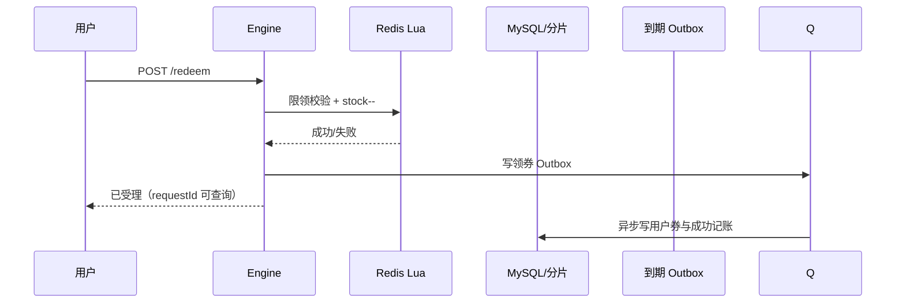
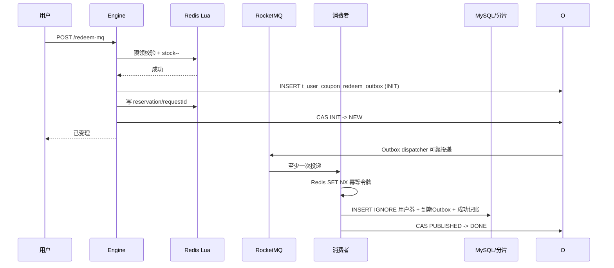
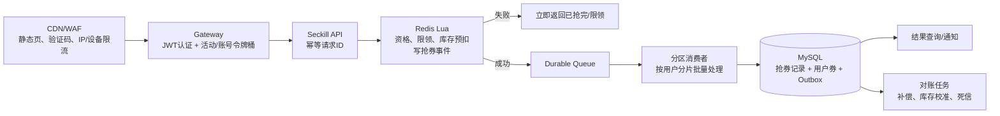

# 优惠券领取（秒杀）高并发架构梳理

> 范围：基于 `2026-08-25` 当前 checkout 的 `engine` 服务代码梳理。本文把“已在代码中核对的当前实现”与“为支持数百万用户同时抢券而建议的目标方案”明确分开。未启动 Redis、RocketMQ、MySQL 或压测，因此吞吐能力不是已验证结论。

## 1. 结论先行

当前实现已经具备秒杀的两个基础能力：

1. Redis Lua 以单线程原子操作完成**库存预扣 + 单用户限领计数**；
2. MySQL 用 `stock >= 1` 的条件更新防止数据库库存扣成负数。

但它**不能直接作为数百万用户并发抢券的生产方案**。原因不是 Lua 不够快，而是 Redis 预扣、RocketMQ 投递和 MySQL 落库不在同一个原子事务内：故障时会出现“Redis 已扣、用户没券”的漏券和库存账实漂移。本文按 demo 项目边界保留当前 mock 用户与网关关闭鉴权的实现，不把它作为本轮代码改造项；真实项目接入方式单独写在后文。

生产目标应是：入口可承受突发流量、Redis 决定抢券资格、成功请求先进入可靠队列、消费者按用户分片异步落库，并以**持久化抢券记录/Outbox + 对账补偿**把 Redis、MQ、MySQL 的最终一致性闭环。

---

## 2. 当前代码中的组件与数据

| 组件 | 当前职责 | 关键位置 |
| --- | --- | --- |
| HTTP 入口 | 同步或 MQ 异步领取 | `engine/.../controller/UserCouponController.java:65-77` |
| 模板缓存 | Redis Hash 缓存、Bloom、互斥锁回源 MySQL | `CouponTemplateServiceImpl.java:95-180` |
| 抢券 Lua | 检查 Hash `stock`、检查用户限领 Key、预扣库存 | `resources/lua/stock_decrement_and_save_user_receive.lua` |
| 同步路径 | Redis 成功后，在本地事务中扣模板库存、插用户券、写到期 Outbox | `UserCouponServiceImpl.java:122-210` |
| 异步路径 | Redis 成功后同步发 RocketMQ | `UserCouponServiceImpl.java:214-263` |
| MQ 消费 | 以 Redis 防重标记保护，然后扣 MySQL 库存并插用户券 | `UserCouponRedeemConsumer.java:72-131` |
| 用户券表 | 用户券最终事实；以 `user_id` 路由 | `t_user_coupon_*`，DDL 见 `resources/database/onecoupon.sql:519-537` |
| 用户券到期 Outbox | 已落库用户券的 ZSet 投影、延迟到期消息与重试 | `UserCouponExpireOutboxDispatcher.java:46-112` |

### 2.1 Redis Key

| Key | 作用 | 代码常量 |
| --- | --- | --- |
| `one-coupon_engine:template:{couponTemplateId}` | 模板 Hash，含 `stock`、规则、有效期等 | `EngineRedisConstant.COUPON_TEMPLATE_KEY` |
| `one-coupon_engine:user-template-limit:{userId}_{couponTemplateId}` | 用户对某券的限领次数 | `USER_COUPON_TEMPLATE_LIMIT_KEY` |
| `user-coupon-redeem:{messageKey}` | MQ 消费中/已消费标记 | `UserCouponRedeemConsumer.java:83-87` |
| `one-coupon_engine:user-template-list:{userId}` | 用户券 ZSet 投影，分数为到期时间 | 到期 Outbox 调度器 |

### 2.2 分片事实与事务边界

- `t_coupon_template` 按 `shop_number` 分为 **2 库 × 16 表**；
- `t_user_coupon` 按 `user_id` 分为 **2 库 × 32 表**；
- `t_user_coupon_redeem_outbox`、`t_user_coupon_redeem_stock_ledger` 与用户券按 `user_id` 同分片；
- 一次领券会同时改模板库存（店铺分片）与用户券（用户分片）。两者可能路由到不同物理库。

当前配置静态扫描未发现 XA、Seata 或 JTA 事务配置。因此不能把 `TransactionTemplate` 或 `@Transactional` 误解为自动获得跨库原子性；在跨库场景应按“本地事务 + 持久化事件 + 幂等消费 + 对账补偿”设计，或经评估后使用分布式事务。

---

## 3. 当前执行流程

### 3.1 公共前置：模板读取与校验

1. 客户端请求 `POST /api/engine/user-coupon/redeem`（同步）或 `/redeem-mq`（异步）。
2. `CouponTemplateServiceImpl.findCouponTemplate` 从 Redis Hash 读取模板。
3. 缓存未命中时：Bloom（仅 `ready=true` 时）→ 空值缓存 → Redisson 模板锁 → 带 `shop_number`、模板 ID、`ACTIVE` 状态和有效时间条件的 MySQL 查询 → 写 Redis Hash，TTL 对齐模板结束时间。
4. 领取服务再次用 `DateUtil.isIn(now, validStartTime, validEndTime)` 拒绝活动外请求。

这一步把绝大多数模板读取挡在 Redis，但活动刚开始的冷缓存会让大量请求争抢同一把模板锁并回源数据库，因此大促前必须预热热券。

### 3.2 Redis Lua 预扣：当前的并发闸门

服务构造两个 Key，调用 `stock_decrement_and_save_user_receive.lua`：

```text
KEYS[1] = one-coupon_engine:template:{templateId}        # Hash 的 stock 字段
KEYS[2] = one-coupon_engine:user-template-limit:{uid}_{templateId}
ARGV[1] = 模板结束时间（当前传入毫秒时间戳）
ARGV[2] = 每人限领数量
```

Lua 串行执行以下操作：

1. `HGET stock`，库存小于等于 0 返回“库存不足”；
2. `GET` 用户限领计数，达到上限返回“限领”；
3. 首次领取 `SET key 1`，否则 `INCR`；
4. `HINCRBY stock -1`；
5. 返回“成功码 + 领取次数”的组合数。

同一个 Redis 主节点上，Lua 不会被其他命令穿插，所以能消除“先查库存再扣库存”的并发超卖竞争。它是**资格判定和缓存库存**的高吞吐路径，不应承担最终账本职责。

### 3.3 同步领取 `/redeem`



当前 `/redeem` 为兼容旧客户端，已经委托到与 `/redeem-mq` 相同的可靠 Outbox 入口，不再在 HTTP 线程逐请求更新模板库存：

1. 先创建 `t_user_coupon_redeem_outbox` 的 `INIT` 记录；
2. Lua 原子完成 Redis 库存、用户限领次数和 request reservation；
3. 将 Outbox 推进为 `NEW`，调度器按分发 Outbox 的租约、重试、PUBLISHED 检查模式投递 RocketMQ；
4. 消费者在用户分片本地事务中插入 `t_user_coupon`、到期 Outbox 和库存成功记账；
5. 独立库存收敛器按 `(shopNumber, couponTemplateId)` 聚合记账，在模板分片一次性扣减 MySQL 库存，并用去重账本避免重试重复扣减。

接口响应只代表“抢券任务已可靠受理”，不代表用户券已经同步写入；前端应按 `requestId` 查询结果或订阅通知。真正的高并发入口应使用这条异步路径。

### 3.4 异步领取 `/redeem-mq`



异步入口现在先持久化领券 Outbox，再由调度器异步投 MQ；发送超时、进程宕机、消费者积压都通过租约过期、重试和 PUBLISHED 回查恢复。Redis reservation key 使同一 `requestId` 重试不会再次扣库存。

### 3.5 真实项目的身份传递与前端限流（本 demo 不改代码）

当前 demo 的 `UserConfiguration.UserTransmitInterceptor` 固定 mock 用户，这是有意保留的教学简化。真实项目建议按以下边界接入：

1. 用户登录后由认证服务签发短时 JWT，或由 BFF 保存 session；前端请求携带 `Authorization: Bearer <JWT>`，不要让前端直接传 `userId` 作为可信身份。
2. 网关验证 JWT 签名、issuer、audience、过期时间和设备/会话状态，解析出 `sub/userId`、设备 ID、租户/店铺等声明。
3. 网关删除客户端自带的 `X-User-Id`，再写入内部可信头，例如 `X-Auth-User`、`X-Auth-Request-Id`；网关到服务之间使用 mTLS 或内部签名（HMAC/短时 service token），服务端只接受来自网关的头并再次验签。
4. Engine 的拦截器从可信头构造 `UserContext`，请求结束清理 ThreadLocal。MQ 事件必须携带 userId，不能依赖 HTTP 线程上下文。

前端限流不是只在按钮上 `disabled`：

- 开售前由服务端返回活动开始时间和签名后的 `activityToken`；前端本地倒计时只用于体验，不能作为安全判断。
- 点击后立即生成一个 UUID `requestId`，在同一轮重试中复用；请求体携带 `couponTemplateId/requestId`。收到 `QUEUED` 后停止重复点击，轮询结果接口时使用指数退避（例如 200ms、500ms、1s、2s、最多 5 次），之后改为 3~5 秒一次或使用 WebSocket/SSE 通知。
- 客户端设置并发闸门：同一用户同一活动最多 1 个 in-flight 请求；超时只允许带相同 requestId 重试，禁止生成新 requestId 盲目重试。
- UI 层可以按设备本地频率限制，例如 1 秒内最多发起 1 次，但这只是减轻误触；真正的 IP、账号、设备、活动维度令牌桶必须在 CDN/WAF/网关执行。
- 网关可采用分层令牌桶：活动总桶限制总放行速率，账号桶限制单用户，设备/IP 桶限制异常来源；令牌不足返回 429 和 `Retry-After`，前端按该值退避，不要立即忙循环。
- 黑名单/风控命中返回统一的 `ACTIVITY_REJECTED`，不要把库存是否存在、用户是否命中黑名单等内部信息暴露给脚本。

---

## 4. 当前实现的问题清单

| 优先级 | 问题与代码证据 | 后果 | 修复方向 |
| --- | --- | --- | --- |
| P0（本轮已修复） | Lua 预扣与 MQ 投递之间没有可靠任务 | 曾存在 Redis 已扣、MQ 未送达的漏券窗口 | 新增 `t_user_coupon_redeem_outbox`；INIT/NEW/PROCESSING/RETRY/PUBLISHED/DONE 状态由调度器可靠投递，requestId 可恢复重试 |
| P0（本轮已修复） | `/redeem-mq` 直接 `syncSend`，失败只打日志 | 发送超时、未知结果或进程崩溃造成任务丢失 | 已改为先写 Outbox，再异步投 MQ；复用分发模块 Outbox 的租约和 PUBLISHED 回查 |
| P0（本轮已修复） | Lua 将毫秒时间戳传给相对秒 `EXPIRE` | 限领 Key TTL 错误 | 已改为 `EXPIREAT key, endTimeSeconds` |
| P0（本轮已修复） | Lua 返回递增前的领取次数 | 首次可能写入 `receive_count=0` | 已返回并持久化 `userCouponCount + 1` |
| P1（本轮已修复） | MQ 消费者数据库扣库存返回 0 时直接 `return` | MQ 被视为成功；此前 Redis 预扣无法回补，用户无券 | 消费者已移除逐请求模板扣库存，失败通过 MQ/Outbox 重试；成功写持久化库存记账 |
| P1（本轮已修复） | 同一模板库存行被每个成功请求 `UPDATE` | 单热行锁竞争限制 MySQL 写入 | 消费者只写用户券和分片记账；`UserCouponRedeemStockSettlementDispatcher` 按模板聚合，一批一次更新模板库存，并用去重账本防重复 |
| P1 | MQ 幂等标记在 Redis，完成标记写在业务事务提交之后 | DB 提交成功、写 `CONSUMED` 前宕机时会重放 | 当前保留 Redis 消费防重，同时使用用户券唯一键、Outbox 状态和 `INSERT IGNORE` 作为数据库最终幂等边界 |
| P1 | 冷缓存会在 Redisson 模板锁后回源 | 热券缓存失效时形成锁竞争与数据库尖峰 | 开售前预热 + 不在开售中删除热券缓存；逻辑过期/异步刷新；Bloom 需完成回灌再启用 |
| P1 | 单 Redis 主节点 Lua 是同 Key/同实例串行 | 单热券吞吐最终受单实例 CPU、网络和脚本执行限制 | Redis Cluster 按活动/模板分片；超热单券使用库存分桶或按分区排队，避免单 Key 过热 |
| P1 | 领取 DTO 的 `shopNumber` 来自客户端 | 若服务未以服务端活动映射校验，可能造成模板-店铺组合探测或路由攻击 | 请求只传活动/模板 ID；服务端读取并校验所属店铺，拒绝不匹配组合 |
| P2 | `receive_count` 最大设计为 9999，组合返回也仅预留 14 bit | 规则上限若大于 9999，会发生编码截断/错误 | 在模板创建时校验限领上限；返回结构改为明确 JSON/多值协议或只返回成功码 |
| P2 | 当前测试主要是上下文、Redis/MQ 示例、分片示例 | 未覆盖百万级语义：重复、宕机、MQ 未知结果、补偿、对账 | 增加纯 Lua/状态机单测、Testcontainers 集成测试、故障演练与压测门禁 |

---

## 5. 面向数百万并发的目标方案

### 5.1 设计原则

1. **入口快速失败**：绝大多数无效、重复、超限请求在 CDN/WAF/网关/Redis 完成，不进入数据库。
2. **Redis 负责抢券资格，数据库负责最终事实**：二者不做分布式强事务，而通过事件记录、幂等和对账达到最终一致。
3. **一个用户的一次领取应有稳定请求 ID**：例如 `activityId:userId:requestId`；重试返回原结果，不再次占库存。
4. **所有跨系统动作可重放**：消息最多一次绝不可靠，消费者必须接受至少一次。
5. **数据库不承受瞬时洪峰**：请求层削峰，消费层按分片分区、批量写入和背压。

### 5.2 推荐执行流程



#### 阶段 A：开售前

- 生成活动 ID、模板 ID、开始/结束时间、总库存、每人上限；请求只接受活动 ID 与客户端幂等键。
- 将热券模板、库存、规则预热到 Redis；检查实际 Redis 主从、Cluster Slot、持久化、内存水位和容量预留。
- 对单券库存按 `N` 个桶初始化，例如 `stock:{activityId}:{0..N-1}`；用户根据 `hash(userId) mod N` 落到固定桶。这样保留每用户确定性并将单 Key 热点拆为 N 个 Redis Key。
- 将模板缓存设置到结束时间；采用 `EXPIREAT`，所有时间由服务端统一时钟产生。

#### 阶段 B：请求入口

- CDN/WAF 负责静态页与机器人拦截；网关校验 JWT、活动时间、设备/IP/账号限流，建议令牌桶按 `activityId` 与 `userId` 组合。
- API 生成/校验 `requestId`，在 Redis 建 `request:{activity}:{user}:{requestId}`，重复请求直接返回 `QUEUED/SUCCESS/FAILED` 状态。
- 不让客户端传入可决定路由或归属的 `shopNumber`；由活动配置查出它。

#### 阶段 C：Redis 原子资格判定

一段短小 Lua 一次完成：

1. 验证活动状态、开始/结束时间和黑名单开关；
2. 检查 `user:{activity}:{userId}` 限领次数；
3. 检查所属库存桶；
4. `DECR` 库存桶、`INCR` 限领、写 `requestId -> QUEUED`；
5. `XADD` 到 Redis Stream（或写可被可靠扫描的抢券事件表）；
6. 任一步失败则不改变任何资格状态。

Redis Stream 时，消费者必须 `XREADGROUP`，数据库事务成功后再 `XACK`；Pending List 要通过 `XAUTOCLAIM` 或等价机制回收故障消费者的未确认消息。若使用 RocketMQ，至少要以**数据库 Outbox**或可靠事件表保障“预扣成功必有可重试事件”。

#### 阶段 D：异步最终落库

消费者按 `userId` 作为队列分区键，确保同用户事件局部有序。每条事件在一个**用户分片本地事务**中完成：

1. `INSERT t_coupon_seckill_record(activity_id, user_id, request_id, status=PROCESSING)`，唯一键 `(activity_id, user_id, request_id)`；冲突则读取已有结果并跳过；
2. 插入 `t_user_coupon`；其唯一约束可以保留为最后一道防线，但领取次数必须正确；
3. 插入结果/通知 Outbox、到期 Outbox；
4. 更新抢券记录为 `SUCCESS`；事务提交；
5. 成功后 ACK Stream/MQ。

模板库存的 MySQL 账本不应在每一成功请求上争抢同一行。可以按“批次聚合扣减 + 库存变动流水”处理，定时/实时把 Redis 成功数与 MySQL 最终发券数、失败补偿数对账。若业务要求强库存财务账，则引入按桶的库存账本/预分配，而非单行条件更新。

#### 阶段 E：失败、补偿与对账

| 场景 | 正确处理 |
| --- | --- |
| Redis 预扣成功，事件未送达 | Stream Pending/事件表扫描重投；不能只依赖应用日志 |
| 消费者宕机 | 其他消费者认领 Pending；同一请求 ID 的数据库唯一键保障幂等 |
| DB 瞬时失败 | 不 ACK；指数退避重试，超过阈值进入死信和人工/自动补偿 |
| DB 最终拒绝（如活动取消） | 事务记录 `FAILED`，用补偿事件原子归还该用户的 Redis 限领和库存桶 |
| Redis 故障/丢数据 | 以 MySQL 抢券记录、用户券、库存流水为事实重建 Redis；活动期间启用 AOF、主从和故障演练 |
| MQ 重复投递 | 使用请求 ID 的唯一约束、状态条件更新；不依赖仅有 TTL 的 Redis 标记 |
| MQ/DB 长期积压 | 启动背压：入口降低放行速率；告警积压深度、消息年龄、Pending 数和失败率 |

---

## 6. 容量模型与压测口径

“数百万用户同时抢”必须先转为可执行指标。建议以 **2,000,000 请求在 60 秒抵达**为例：入口峰值约 `33,333 RPS`；若 80% 是限领/无库存等快速失败，Redis 成功资格请求约 `6,667 RPS`。这只是一种假设，不是当前系统已达能力。

| 层 | 目标与观测指标 |
| --- | --- |
| CDN/WAF/Gateway | 接入 RPS、拒绝率、认证失败率、各维度限流命中率、P99 延迟 |
| Redis | Lua EVAL 延迟 P99、CPU、慢日志、单槽/单 Key 热度、复制延迟、内存和命中率 |
| Stream/MQ | 生产成功率、积压深度、最老消息年龄、Pending 数、重试/死信数 |
| 消费服务 | 每分区消费速率、批量大小、线程池队列、GC、失败与补偿数 |
| MySQL | 用户券行写入速率、事务 P99、分片倾斜、锁等待、redo/binlog、连接池、磁盘 IOPS |
| 业务正确性 | Redis 成功数 = `SUCCESS` + `FAILED后已补偿` + `待处理`；绝不出现负库存或同请求多券 |

压测分四段进行，而非直接用“百万并发”做结论：

1. **单元与状态机**：Lua 成功/无库存/限领、TTL、领取次数、重复 requestId、补偿幂等；
2. **集成**：Redis、RocketMQ/Stream、MySQL 分片实际启动，验证宕机、超时、重复投递；
3. **递增压测**：1k → 5k → 10k → 目标 RPS，分别测试单热券与多券分桶；
4. **故障演练**：在 Redis 预扣后杀生产者、DB 提交后杀消费者、RocketMQ 重投、Redis 主从切换、消费者积压，完成自动对账后检查零漏券、零超发。

上线门禁至少包含：成功率、P99、库存差异、消息积压和补偿完成时间的阈值；每次压测保存原始请求结果、Redis/MQ/MySQL 指标、版本 SHA、配置快照与对账报告。

---

## 7. 建议的实施优先级

1. **先修 P0 正确性与安全问题**：真实身份传递、网关限流、Lua TTL/次数修复、可靠事件账本；这些不完成，不应开放秒杀。
2. **替换当前异步路径**：选择 Redis Stream + Pending/ACK，或持久化抢券事件 + Outbox；补齐可重试与对账。
3. **消除 MySQL 单库存热行**：消费者按用户分片批量写用户券，库存采用预分桶/库存流水/批量结算。
4. **建设观测和压测门禁**：先证明正确性，再逐级测出可承受 RPS；没有实测数据时不承诺“百万级”。

## 8. 阅读源码建议顺序

1. `engine/.../controller/UserCouponController.java`
2. `engine/.../service/impl/UserCouponServiceImpl.java`
3. `engine/src/main/resources/lua/stock_decrement_and_save_user_receive.lua`
4. `engine/.../mq/consumer/UserCouponRedeemConsumer.java`
5. `framework/.../idempotent/NoMQDuplicateConsumeAspect.java`
6. `engine/.../service/outbox/UserCouponExpireOutboxDispatcher.java`
7. `engine/src/main/resources/shardingsphere-config.yaml`

这样能先理解“资格判定”，再理解“最终发券”和“失败后的可恢复性”。
