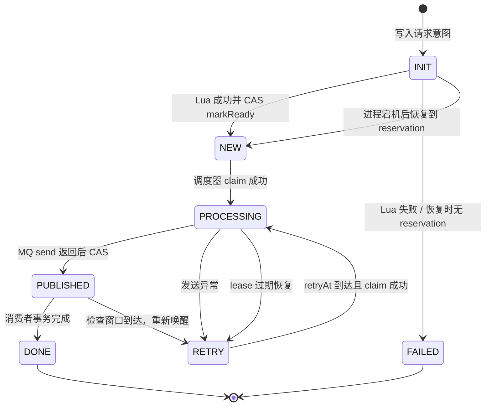
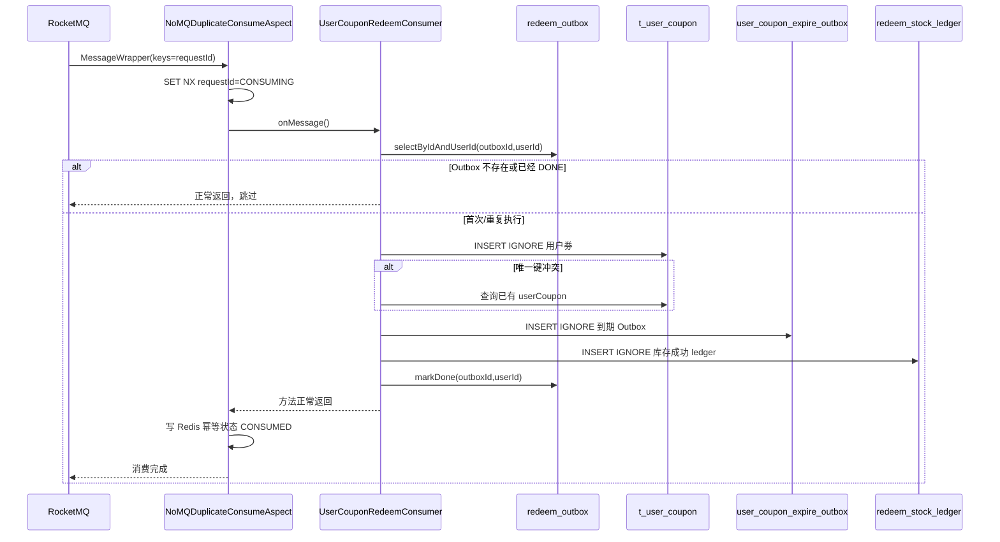
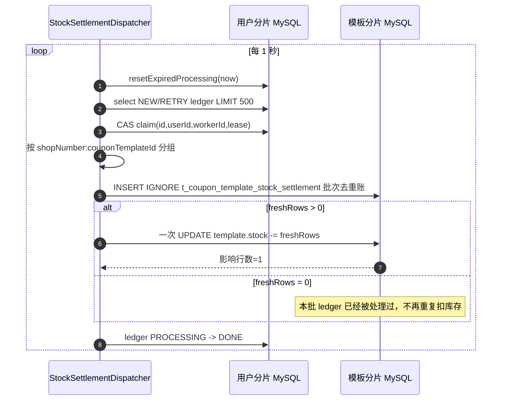
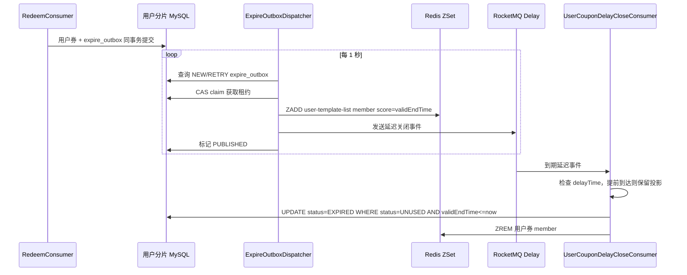
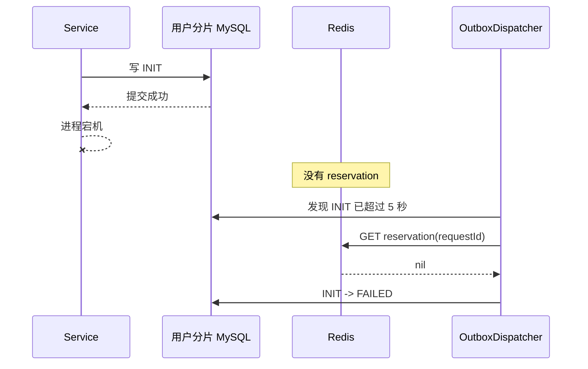
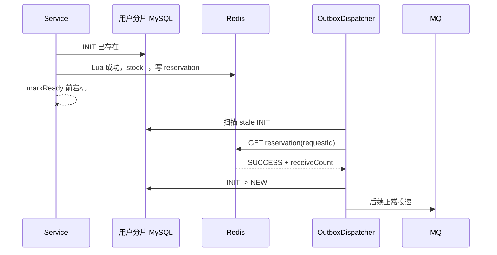

# 优惠券领取（秒杀）当前流程与高并发设计说明

> 文档范围：当前 checkout 中 `engine` 服务的优惠券领取链路。本文以代码已经实现的版本为准，重点解释 `UserCouponServiceImpl`、Redis Lua、领券 Outbox、RocketMQ 消费者、用户券到期 Outbox 和模板库存批量收敛之间的关系。
>
> 重要边界：这是 demo 项目，`UserConfiguration` 仍使用固定 mock 用户，网关认证和真实用户体系不在本轮代码改造范围。本文会说明真实系统应如何接入，但不会把 mock 实现描述成生产身份系统。

---

## 1. 先看结论

当前秒杀入口已经不是“Redis 扣库存后直接同步写 MySQL”，而是下面这条异步可靠链路：

```text
HTTP 请求
  -> 模板缓存/有效期校验
  -> 写入领券 Outbox：INIT
  -> Redis Lua 原子校验限领并预扣库存
  -> 领券 Outbox：INIT -> NEW
  -> Outbox 调度器租约抢占并发送 RocketMQ
  -> 领券 Outbox：PROCESSING -> PUBLISHED
  -> RocketMQ 消费者在用户分片事务内写用户券、到期 Outbox、库存 ledger
  -> 领券 Outbox：PUBLISHED -> DONE
  -> 库存收敛器按模板聚合 ledger，批量扣减 MySQL 模板库存
```

这套设计把一次领券拆成三个不同速度的阶段：

1. **毫秒级资格判定**：Redis Lua 只处理热路径上的库存和限领；
2. **可恢复的异步落库**：Outbox + RocketMQ 把突发流量削峰，用户券写入按 `user_id` 分片；
3. **低频批量记账**：库存 ledger 按模板聚合后再更新 `t_coupon_template`，避免所有请求争抢同一条库存行。

因此，HTTP 接口返回成功的含义是“领券请求已经受理并进入可靠处理链路”，不是“用户券已经在当前 HTTP 请求内完成 MySQL 落库”。

---

## 2. 当前代码地图

### 2.1 入口与服务类

| 层次 | 当前代码 | 作用 |
| --- | --- | --- |
| HTTP Controller | `engine/.../controller/UserCouponController.java` | 暴露 `/api/engine/user-coupon/redeem` 与 `/redeem-mq` |
| 领取服务 | `engine/.../service/impl/UserCouponServiceImpl.java` | 模板校验、创建 INIT Outbox、执行 Lua、推进 NEW |
| Redis 脚本 | `engine/src/main/resources/lua/stock_decrement_and_save_user_receive.lua` | 原子检查库存、检查限领、预扣库存、保存 reservation |
| 领券 Outbox | `UserCouponRedeemOutboxDO`、`UserCouponRedeemOutboxMapper` | 持久化待投递领券任务与租约状态 |
| Outbox 调度器 | `UserCouponRedeemOutboxDispatcher` | INIT 恢复、租约抢占、RocketMQ 投递、重试 |
| MQ 生产者 | `UserCouponRedeemProducer` | 使用 `requestId` 作为 RocketMQ message key |
| MQ 消费者 | `UserCouponRedeemConsumer` | 用户分片本地事务内写券、到期 Outbox、库存 ledger |
| 库存收敛器 | `UserCouponRedeemStockSettlementDispatcher` | 按模板聚合 ledger，批量更新 MySQL 模板库存 |
| 到期调度器 | `UserCouponExpireOutboxDispatcher` | 用户券写 Redis ZSet、投递到期延迟消息 |
| 到期消费者 | `UserCouponDelayCloseConsumer` | 条件更新用户券为 EXPIRED，删除 Redis ZSet 成员 |

Engine 启动类使用 `@EnableScheduling`，因此上述多个 Outbox 调度器会在每个 Engine 实例内定时运行；真正执行权依靠数据库状态 CAS 和租约，而不是依靠“只有一个实例运行”。

另外，当前分支中的 `UserCouponSettlementProjectionOutboxDispatcher` 负责下单、支付、退款、取消等结算状态变化后的 Redis 投影收敛；它属于领券成功之后的结算生命周期，不是本次秒杀入口的必经步骤，不能和 `UserCouponExpireOutboxDispatcher` 或领券 Outbox 混为一谈。

### 2.2 当前两个 HTTP 入口的真实关系

Controller 虽然保留了两个接口：

```text
POST /api/engine/user-coupon/redeem
POST /api/engine/user-coupon/redeem-mq
```

但 `UserCouponServiceImpl.redeemUserCoupon` 当前只是调用：

```java
redeemUserCouponByMQ(requestParam);
```

因此当前代码中已经没有“一个同步入口直接落库、另一个入口异步落库”的两套主流程。两个接口最终都走可靠 Outbox。保留两个接口主要是兼容旧调用方和教学演示。

### 2.3 请求参数

`CouponTemplateRedeemReqDTO` 当前包含：

| 字段 | 作用 |
| --- | --- |
| `source` | 券来源，例如领券中心、平台发放、店铺领取 |
| `shopNumber` | 店铺分片键；当前 demo 由请求携带，生产环境应由服务端校验模板归属 |
| `couponTemplateId` | 优惠券模板 ID |
| `requestId` | 本次领取的业务幂等键；客户端重试必须复用同一个值 |

如果请求没有携带 `requestId`，当前服务会用 `IdUtil.fastSimpleUUID()` 生成。但 Controller 返回的是 `Result<Void>`，不会把这个自动生成的 ID 返回给前端，所以生产调用方应主动生成并携带 `requestId`，否则网络超时后无法可靠地用同一业务 ID 重试。

---

## 3. 数据、分片与 Redis Key

### 3.1 数据表与分片

| 逻辑表 | 分片键 | 物理规模 | 用途 |
| --- | --- | --- | --- |
| `t_coupon_template` | `shop_number` | 2 库 × 16 表 | 模板定义与最终库存账 |
| `t_user_coupon` | `user_id` | 2 库 × 32 表 | 用户券最终事实 |
| `t_user_coupon_redeem_outbox` | `user_id` | 2 库 × 32 表 | 领券请求可靠投递 |
| `t_user_coupon_redeem_stock_ledger` | `user_id` | 2 库 × 32 表 | 成功发券的库存记账 |
| `t_user_coupon_expire_outbox` | `user_id` | 2 库 × 32 表 | 用户券到期派生事件 |
| `t_coupon_template_stock_settlement` | `shop_number` | 2 库 × 16 表 | 模板库存批量扣减去重账 |

一次领券同时涉及两类分片：

```text
用户相关事实：user_id -> t_user_coupon、redeem_outbox、ledger、expire_outbox
模板相关事实：shop_number -> t_coupon_template、stock_settlement
```

所以不把“Redis 预扣、用户券写入、模板库存更新、MQ 投递”强行包装成一个跨系统/跨库大事务，而是使用：

```text
用户分片本地事务 + Outbox + 至少一次消息 + 幂等写入 + 模板库存批量收敛
```

这是当前设计的核心边界。

### 3.2 Redis Key

| Key | 数据结构 | 作用 |
| --- | --- | --- |
| `one-coupon_engine:template:{templateId}` | Hash | 模板缓存，至少包含 `stock`、规则、有效期等字段 |
| `one-coupon_engine:user-template-limit:{userId}_{templateId}` | String | 某用户领取某模板的次数 |
| `one-coupon_engine:redeem-reservation:{requestId}` | String | 本次 requestId 的 Redis 预扣结果，防止恢复/重试再次扣库存 |
| `user-coupon-redeem:{messageKey}` | String | MQ 消费短期防重状态：CONSUMING/CONSUMED |
| `one-coupon_engine:user-template-list:{userId}` | ZSet | 用户券 Redis 投影，member 为 `{templateId}_{userCouponId}`，score 为到期时间 |

### 3.3 数据库唯一性边界

用户券物理表存在唯一键：

```text
(user_id, coupon_template_id, receive_count)
```

它用于兜住 RocketMQ 重复投递、消费者重启和 Redis 幂等 Key 过期后的重复执行。Redis 防重可以减少重复执行，但不能替代数据库唯一键。

领券 Outbox 的唯一业务约束是：

```text
(user_id, request_id)
```

因此一个 `requestId` 在当前实现中应只代表一个用户的一次领券请求；生产环境应明确 requestId 的生成范围，例如由客户端生成 UUID，或服务端使用 `activityId:userId:uuid` 组合键。

---

## 4. 完整成功时序图

下面这张图描述一次请求从进入 Engine 到模板库存最终收敛的完整路径。它把“快速返回”和“最终落库”分开画出，避免误解接口返回时机。

.png)

### 4.1 为什么请求要先写 INIT，再执行 Lua？

如果只执行 Lua，不写持久化任务，会有以下故障窗口：

```text
Redis 预扣成功 -> Java 进程宕机 -> 没有任何任务记录 -> 无法知道是否需要投递 MQ
```

当前代码先写 `INIT`，再执行 Lua，是为了给这个窗口留下可扫描的 durable intent：

- 如果 Java 在 Lua 前宕机，INIT 恢复器发现没有 reservation，可以把任务标记为 FAILED，避免无依据地重复扣库存；
- 如果 Lua 已成功、Java 在 `markReady` 前宕机，INIT 恢复器能读到 reservation，并补推进为 NEW；
- 如果 Lua 返回库存不足或限领失败，服务把 INIT 标记为 FAILED，数据库中有可审计的失败原因。

它没有让 MySQL 和 Redis 获得分布式强一致，但把“进程崩溃后完全失去上下文”的问题转成了可恢复状态机。

### 4.2 为什么 Redis Lua 要同时处理库存和限领？

库存和用户限领必须在同一个原子脚本中决定，否则会出现：

```text
请求 A 读取库存=1
请求 B 读取库存=1
请求 A 通过用户限领
请求 B 也通过用户限领
两个请求随后分别扣减，发生超卖或错误占用
```

当前脚本一次完成：

1. 读取 `reservation`，优先返回相同 requestId 的历史结果；
2. 读取模板 Hash 的 `stock`；
3. 读取用户限领计数；
4. 判断库存和限领上限；
5. 首次领取用 `SET + EXPIREAT`，再次领取用 `INCR`；
6. `HINCRBY stock -1`；
7. 把组合结果写入 request reservation。

Redis Lua 在单个 Redis 执行上下文中不会被其他命令插入，因此“检查资格”和“扣减资格”是一个不可分割的动作。

### 4.3 为什么成功返回的是递增后的 receiveCount？

Lua 使用 14 bit 保存第二字段，当前约定为最多 9999 次：

```text
firstField = 0：成功
firstField = 1：库存不足
firstField = 2：达到限领
secondField = 本次领取后的次数
```

第一次领取时原计数为 0，但用户券唯一键和业务语义需要 `receive_count=1`，所以当前脚本返回 `userCouponCount + 1`。消费者把这个值写入用户券，避免第一次领取写成 0。

---

## 5. 阶段一：模板读取与活动校验

入口进入 `UserCouponServiceImpl.redeemUserCouponByMQ` 后，首先调用：

```java
couponTemplateService.findCouponTemplate(
    BeanUtil.toBean(requestParam, CouponTemplateQueryReqDTO.class)
)
```

`CouponTemplateServiceImpl.findCouponTemplate` 的当前查询顺序是：

```text
Redis Hash 命中
  -> 直接反序列化并 assertEffective

Redis 未命中
  -> Bloom（只有 ready=true 才作为拒绝条件）
  -> 空值缓存
  -> Redisson 模板锁
  -> 双重检查 Redis
  -> MySQL 查询
  -> Lua HMSET + EXPIREAT 写回缓存
  -> assertEffective
```

数据库查询同时带有：

- `shop_number = request.shopNumber`；
- `id = request.couponTemplateId`；
- 模板状态为 ACTIVE；
- `validStartTime <= now`；
- `validEndTime > now`。

服务层随后再次校验有效时间。这样做的原因是 Redis TTL、Bloom 和模板状态都属于优化/前置过滤，不能单独作为业务有效性的最终依据。

### 5.1 为什么要保留模板快照？

服务在 INIT Outbox 中保存 `templateSnapshot`，调度器发送 MQ 时把快照反序列化成事件中的 `couponTemplate`。

这样消费者不必再次回源模板缓存或数据库，主要解决三个问题：

1. **削峰**：成功抢券的消费者不会在洪峰期间再次集中读取模板；
2. **一致性**：请求受理时使用的 `consumeRule`、有效期等配置被固定下来，不会因为后台随后修改模板而让同一个已受理请求使用另一套规则；
3. **故障隔离**：模板缓存短暂失效时，已经进入 Outbox 的任务仍然可以继续投递。

代价是快照可能与最新模板配置不同，因此生产实现应给快照增加版本号或配置更新时间，便于审计和处理模板变更。

---

## 6. 阶段二：领券 Outbox 状态机

### 6.1 状态定义



状态不是普通日志字段，而是分布式协作协议：

| 状态 | 含义 | 谁负责推进 |
| --- | --- | --- |
| `INIT` | 已持久化请求，但 Redis 资格结果尚未确认 | HTTP 服务、INIT 恢复器 |
| `NEW` | Redis 预扣成功，等待 MQ 投递 | HTTP 服务或恢复器 |
| `PROCESSING` | 某个调度器实例持有租约 | Outbox 调度器 |
| `RETRY` | 发送异常或租约过期，等待下次发送 | Outbox 调度器 |
| `PUBLISHED` | MQ 已尝试发送，等待消费者最终状态 | 调度器与消费者 |
| `DONE` | 用户券本地事务已提交 | MQ 消费者 |
| `FAILED` | 本次请求不能继续，例如库存不足、限领或 INIT 无 reservation | 服务/恢复器 |

### 6.2 调度器每次执行的顺序

`UserCouponRedeemOutboxDispatcher.dispatchReadyEvents` 每秒执行一次：

1. `recoverInterruptedReservations`：扫描超过 5 秒的 INIT；
2. `resetExpiredProcessing`：把 lease 已过期的 PROCESSING 改为 RETRY；
3. `checkPublishedEvents`：把到检查时间仍为 PUBLISHED 的任务重新排队；
4. 查询 NEW 或到期 RETRY；
5. 对每一条执行 `claim(id, userId, workerId, leaseUntil)`；
6. 只有受影响行数为 1 的实例才真正发送 MQ；
7. 发送成功后标记 PUBLISHED，异常则按指数退避标记 RETRY。

当前配置：

```yaml
one-coupon:
  user-coupon-redeem-outbox:
    batch-size: 200
    lease-seconds: 30
    published-check-seconds: 15
    init-recovery-seconds: 5
    fixed-delay-ms: 1000
```

### 6.3 为什么必须用数据库 CAS 租约？

假设 Engine 部署了 10 个实例。如果调度器只是 `SELECT status='NEW'` 后直接发送，那么 10 个实例可能同时拿到同一行，造成 10 条重复 MQ。

当前流程把“读取”和“获得处理权”分开：

```sql
UPDATE t_user_coupon_redeem_outbox
SET status = 'PROCESSING', worker_id = ?, lease_until = ?
WHERE id = ?
  AND user_id = ?
  AND status IN ('NEW', 'RETRY');
```

只有 `affected_rows = 1` 的实例获得处理权。实例宕机后，其他实例可以在 `lease_until` 过期后把任务恢复到 RETRY。这是多实例定时任务能够安全并行的关键。

### 6.4 为什么 PUBLISHED 还要重新检查？

MQ 发送存在“未知结果”窗口：

```text
Producer 发出请求 -> Broker 可能已接受 -> Producer 网络超时 -> 应用无法确认发送结果
```

当前系统选择至少一次投递：

- 发送成功后进入 PUBLISHED；
- PUBLISHED 到检查时间仍未被消费者标记 DONE，就重新进入 RETRY；
- 重新投递的重复消息由 Redis 防重、用户券唯一键和 DONE 状态共同兜底。

这不是“消息只消费一次”，而是“消息允许重复，但业务结果只能落一次”。

---

## 7. 阶段三：RocketMQ 消息与消费者幂等

### 7.1 消息内容

`UserCouponRedeemEvent` 携带：

| 字段 | 作用 |
| --- | --- |
| `outboxId` | 回查、更新领券 Outbox 的主键 |
| `requestId` | 业务幂等键，同时用于 RocketMQ Keys |
| `requestParam` | source、shopNumber、couponTemplateId、requestId |
| `receiveCount` | Lua 返回的本次领取次数 |
| `couponTemplate` | INIT 阶段保存的模板快照 |
| `userId` | MQ 线程不依赖 HTTP UserContext，直接使用事件中的用户 ID |

生产者 `UserCouponRedeemProducer` 的 `keys` 使用 `messageSendEvent.getRequestId()`，消息包装器的 `keys` 也使用同一个值。因此同一次业务重投会产生相同的幂等键。

### 7.2 两层幂等

消费者方法使用：

```java
@NoMQDuplicateConsume(
    keyPrefix = "user-coupon-redeem:",
    key = "#messageWrapper.keys",
    keyTimeout = 600
)
```

切面内部执行：

```text
SET user-coupon-redeem:{requestId} CONSUMING NX GET PX 600000
```

结果含义：

| Redis 结果 | 行为 |
| --- | --- |
| Key 不存在 | 当前消费者获得执行权 |
| 已是 CONSUMING | 抛出幂等异常，让 RocketMQ 延迟重试 |
| 已是 CONSUMED | 直接跳过重复消息 |
| 业务方法抛异常 | 删除幂等 Key，让 MQ 可以重新投递 |
| 业务方法正常返回 | 写 CONSUMED，保留 600 秒 |

数据库仍然是第二层最终边界：

1. 消费者先按 `outboxId + userId` 查询领券 Outbox；不存在或已经 DONE 直接返回；
2. 用户券使用 `INSERT IGNORE`；
3. 如果插入被唯一键忽略，再按 `userId + couponTemplateId + receiveCount` 查询原记录；
4. 到期 Outbox 和库存 ledger 也使用 `INSERT IGNORE`；
5. 最后在同一个用户分片事务中把领券 Outbox 标记 DONE。

因此，即使 Redis 幂等 Key 过期、消费进程在事务提交后崩溃，重复消息也不会创建第二张用户券或第二条有效库存记账。

---

## 8. 阶段四：用户券本地事务

`UserCouponRedeemConsumer.onMessage` 的核心事务顺序如下：



### 8.1 为什么这些写入要放在用户分片本地事务？

用户券、领券 Outbox、到期 Outbox 和库存 ledger 的分片键都是 `user_id`。对同一个用户而言，它们可以路由到同一个物理库，从而在一个普通 MySQL 本地事务中保证：

```text
用户券已经成功 -> 到期任务不会丢 -> 库存成功记账不会丢 -> 领券任务才会 DONE
```

如果把用户券插入和库存 ledger 写入拆成两个独立事务，可能出现用户已经拿到券但模板库存没有成功记账。当前实现把这三类用户分片数据和 Outbox 状态放在同一事务中，减少半成功状态。

### 8.2 为什么不在消费者里更新模板库存？

模板表按 `shop_number` 分片，所有成功领券如果逐条执行：

```sql
UPDATE t_coupon_template
SET stock = stock - 1
WHERE shop_number = ? AND id = ? AND stock >= 1;
```

即使用户券表已经按用户分片，模板库存仍会变成一个热点行：

- 大量事务争抢同一行锁；
- MySQL redo/binlog 和锁等待随请求数线性增加；
- MQ 消费吞吐被模板库存写入速度限制；
- 用户分片事务和模板分片事务还不在同一个物理库。

当前消费者只写 `t_user_coupon_redeem_stock_ledger`，把模板库存更新延迟到批量收敛阶段。Redis 负责秒杀瞬间的资格裁决，ledger 负责把成功事实可靠记录下来，MySQL 模板库存负责最终账务收敛。

---

## 9. 阶段五：库存 ledger 批量收敛

### 9.1 收敛时序图



### 9.2 为什么需要模板分片上的去重账本？

批量事务完成后，进程可能在“模板库存已经扣减”和“用户分片 ledger 标记 DONE”之间崩溃：

```text
模板库存已经扣了 500
用户分片 ledger 仍然是 PROCESSING
租约过期后，ledger 会被重新消费
```

如果没有 `t_coupon_template_stock_settlement`，下一次重试可能再次扣 500，造成少库存。当前流程先在模板分片写入以 ledger ID 为主键的去重记录：

```sql
INSERT IGNORE INTO t_coupon_template_stock_settlement
    (id, shop_number, coupon_template_id, amount, create_time)
VALUES (...);
```

只有真正插入的新记录数 `freshRows` 才参与模板库存扣减。重试时 `freshRows=0`，不会重复扣减。

### 9.3 为什么按模板分组？

一次调度可能同时取到多个店铺、多个模板的 ledger。代码按：

```text
shopNumber + ":" + couponTemplateId
```

分组，每组单独在模板分片事务中收敛。这样可以保证一次 `UPDATE` 只针对一个模板行，并且 `shop_number` 始终作为 ShardingSphere 路由键，避免广播到多个模板分片。

### 9.4 当前跨分片边界

ledger 的 `DONE` 更新发生在模板分片事务成功之后，并不和模板库存扣减共用一个跨库事务。当前实现用“可重试 + 去重”替代 XA/Seata 跨库强事务：

```text
模板分片事务：去重账本 + 模板库存扣减
用户分片更新：ledger PROCESSING -> DONE
```

如果第二步失败，ledger 会重试；模板分片去重账本阻止第二次扣减。牺牲的是短时间状态同步速度，换取高并发下更低的事务协调成本。

---

## 10. 阶段六：用户券到期派生链路

这不是“抢券资格判定”的一部分，而是用户券成功落库之后的异步副作用。

### 10.1 到期时序图



### 10.2 为什么到期投影也使用 Outbox？

用户券事实写入 MySQL 后，Redis ZSet 和延迟消息都属于派生数据。如果在用户券事务里直接写 Redis 或发送 MQ，就会重新引入 MySQL 已提交但 Redis/MQ 失败的窗口。

当前把到期事件作为同一用户分片事务中的 Outbox，之后由调度器重试。Redis `ZADD`、RocketMQ 重复延迟消息、数据库条件更新和 `ZREM` 都设计成幂等动作，因此可以接受至少一次投递。

---

## 11. 失败路径与恢复时序

### 11.1 Java 在 Redis Lua 前宕机



这个路径不会凭空执行 Lua，也不会重新扣库存，因为系统没有看到成功 reservation。

### 11.2 Redis Lua 成功后、markReady 前宕机



这就是 reservation Key 的主要价值：它把 Redis 已经完成的资格判定结果保存下来，让数据库任务可以继续推进。

### 11.3 MQ 发送超时但 Broker 已接收

```text
调度器 claim -> syncSend 超时
       |                         |
       | Broker 可能已收到        | 调度器无法确认
       v                         v
    PUBLISHED/RETRY        任务下次再次投递
       \                       /
        \--> 消费者重复消息 --/
              |
              +-- Redis requestId 防重
              +-- Outbox DONE 检查
              +-- t_user_coupon 唯一键
              +-- INSERT IGNORE ledger/expire_outbox
```

当前系统选择“允许重复投递，禁止重复业务结果”，而不是追求 MQ 层面的 exactly-once。

### 11.4 消费者写库后、幂等 Key 写 CONSUMED 前宕机

1. 用户券、到期 Outbox、库存 ledger 和领券 Outbox DONE 已在本地事务中提交；
2. 消费进程尚未把 Redis 幂等 Key 改为 CONSUMED 就宕机；
3. RocketMQ 可能重新投递；
4. 重复消费者读取领券 Outbox 已为 DONE，直接返回；
5. 即使状态读取发生在边界窗口，`INSERT IGNORE` 和用户券唯一键也会阻止重复发券。

### 11.5 库存收敛器在模板扣减后宕机

1. 模板分片的去重账本和模板库存扣减已经提交；
2. 用户分片 ledger 尚未 DONE；
3. 租约过期，ledger 重新进入 RETRY；
4. 下一次模板分片 `INSERT IGNORE` 得到 0 条新记录；
5. 不再扣减模板库存，只把 ledger 推进 DONE。

---

## 12. 为什么整体要这样设计

| 设计 | 解决的问题 | 代价/边界 |
| --- | --- | --- |
| Redis Lua 资格判定 | 把热路径从 MySQL 行锁移到内存原子操作，快速拒绝无库存和超限请求 | Redis 成为活动期间的关键依赖；脚本三 Key 在 Redis Cluster 中必须同槽 |
| INIT Outbox | 覆盖“任务已收到但 Lua/Java 进程中断”的窗口 | Redis 与 MySQL 仍非强一致，需要恢复器解释 reservation |
| requestId + reservation | 客户端重试和服务恢复使用同一业务结果，不重复扣库存 | 当前 Controller 不返回自动生成的 requestId，调用方应主动传入 |
| 用户分片 Outbox | 让领券任务、用户券、到期 Outbox、ledger 能在用户库本地事务内提交 | 模板库存位于另一类分片，最终收敛不是同一跨库事务 |
| RocketMQ 异步削峰 | HTTP 不等待用户券写库，消费者可以按吞吐扩容 | 用户感知是“已受理”，需要结果查询/通知能力 |
| 租约 CAS | 多个 Engine 实例可以同时扫描而不重复持有同一任务 | 租约时长必须大于正常单批处理耗时，否则会发生重入 |
| PUBLISHED 回查重投 | 覆盖消息发送未知结果和消费者宕机 | 需要下游幂等，不能把重复消息当异常 |
| 用户券唯一键 + INSERT IGNORE | 让数据库成为重复发券的最终防线 | 必须保证 receiveCount 的业务语义正确、唯一键完整 |
| ledger 批量收敛 | 避免每次领券更新同一模板库存热行 | MySQL 模板库存短时间是最终一致，需要积压/差异监控 |
| 到期 Outbox | 用户券事实与 Redis ZSet/延迟消息解耦 | 到期显示和数据库状态之间允许短暂延迟 |

### 12.1 为什么不是 Redis 成功后立刻返回“已领取”？

Redis 预扣只能证明用户在秒杀资格层抢到了一个名额。它还不能证明 RocketMQ 已被可靠接收、用户券已写入 MySQL、到期任务已持久化、模板库存最终账已经收敛。

所以当前接口的 success 更准确地解释为“请求已受理”。如果产品要展示“领取成功/处理中/失败”，还需要增加按 `requestId` 查询 Outbox 状态的接口，或在消费完成后通过 WebSocket、站内信或推送通知用户。

### 12.2 为什么不把 Redis、MySQL、RocketMQ 放进分布式事务？

理论上可以使用 XA/Seata，但秒杀场景中会带来长事务、锁持有时间增加、协调成本上升和故障影响面扩大。当前方案只把必须本地一致的写操作放在同一分片事务内，把跨系统动作变成可重放派生事件，并用唯一键和去重账本实现最终一致。这是更适合秒杀峰值的工程折中。

---

## 13. 当前实现的限制与需要继续验证的点

### 13.1 Redis Cluster 分槽问题

Lua 使用三个 Key，但当前 key 没有 Redis Cluster hash tag。如果部署 Redis Cluster，三个 Key 很可能落在不同 slot，EVAL 会触发 CROSSSLOT。当前本地配置是单 Redis 地址，因此 demo 可以运行；生产 Cluster 需要使用同一 hash tag 设计 Key，或重新拆分脚本并重新设计原子性。

### 13.2 requestId 结果查询缺失

当前 Controller 返回 `Result<Void>`，没有返回 requestId、Outbox status、userCouponId 或失败原因。生产版本建议增加按当前用户和 requestId 查询 Outbox 的接口，返回 `PROCESSING/DONE/FAILED`，DONE 时返回用户券 ID。

### 13.3 当前 demo 用户不是多用户压测模型

`UserConfiguration.UserTransmitInterceptor` 固定设置一个用户。因此本地直接压测时所有请求共用一个用户限领 Key、共用一个 user_id 分片，并不能观察真实用户分片均衡情况。这属于 demo 约束，不需要为了本轮阅读修改；正式压测必须注入不同 userId。

### 13.4 模板库存账是最终一致

必须监控 Redis 预扣成功数、用户券成功数、ledger NEW/PROCESSING/RETRY 数量、模板去重账本累计 amount、`t_coupon_template.stock` 和 backlog 最老消息年龄。如果 ledger 长时间积压，系统可能出现用户券已经增加但模板 MySQL 库存还未同步减少的短时差异。

### 13.5 10 分钟 Redis MQ 幂等 TTL 不是最终事实

`NoMQDuplicateConsume` 的 Key 只保留 600 秒。它的职责是短时间减少重复消费和并发重入；永久幂等依靠领券 Outbox DONE、用户券唯一键、到期 Outbox、库存 ledger 和模板分片去重账本。

### 13.6 Outbox 调度器吞吐要实测

当前默认每秒最多扫描 200 条领券 Outbox，库存收敛每秒最多扫描 500 条 ledger。实际吞吐还受 RocketMQ、线程池、数据库连接池、分片锁等待和模板分组数量影响，不能只根据 batch-size 推导百万级容量。

---

## 14. 前端调用建议（基于当前接口语义）

当前接口是异步受理模型，前端建议：

1. 点击前生成 UUID `requestId`；
2. 同一轮超时重试始终复用这个 requestId；
3. 同一用户、同一活动只允许一个 in-flight 请求；
4. HTTP 返回成功后展示“排队中/处理中”，不要立即假设用户券已经可用；
5. 生产环境增加结果查询接口后，用 200ms、500ms、1s、2s 的指数退避查询，再转为低频轮询或推送；
6. 如果接口返回 429，遵守 `Retry-After`，不要立即忙循环重试；
7. 如果返回库存不足或达到限领，停止使用同一个 requestId 重试；
8. 不要让前端自行修改 `userId`，真实用户身份由认证层传递；当前 demo mock 用户除外。

---

## 15. 代码阅读顺序

建议按下面顺序重新阅读当前代码：

1. `UserCouponController`：确认两个接口最终走同一服务方法；
2. `UserCouponServiceImpl.redeemUserCouponByMQ`：看 INIT、模板快照、Lua 和 NEW；
3. `stock_decrement_and_save_user_receive.lua`：看原子资格判定和 reservation；
4. `UserCouponRedeemOutboxMapper.xml`：看状态机 SQL 和租约 CAS；
5. `UserCouponRedeemOutboxDispatcher`：看 INIT 恢复、MQ 投递和 PUBLISHED 重排；
6. `UserCouponRedeemProducer` 与 `UserCouponRedeemEvent`：看 requestId 如何穿透消息；
7. `UserCouponRedeemConsumer`：看用户分片本地事务和数据库幂等；
8. `UserCouponRedeemStockSettlementDispatcher`：看 ledger 聚合、模板分片扣减和去重；
9. `UserCouponExpireOutboxDispatcher`：看成功用户券如何生成 Redis/ZSet 和到期消息；
10. `UserCouponDelayCloseConsumer`：看到期条件更新和缓存删除；
11. `shardingsphere-config.yaml` 与 `V20260825__user_coupon_redeem_outbox.sql`：核对逻辑表、物理表和路由键。

读完这 11 个位置后，应该能够回答四个核心问题：

```text
1. 请求在哪一步被快速拒绝？        Redis Lua
2. Redis 成功后如何保证任务不丢？   user_coupon_redeem_outbox
3. 重复消息如何不重复发券？        Redis 短防重 + DB 唯一键 + Outbox DONE
4. 为什么不会每请求争抢模板库存？   user_coupon_redeem_stock_ledger 批量收敛
```

---

## 16. 总结

当前秒杀设计的核心不是某一个 Redis 命令，而是把不同一致性要求拆开：

```text
Redis：快速、原子地决定“有没有资格占一个名额”
Outbox：把已受理请求变成可扫描、可重试的持久化任务
RocketMQ：承担异步削峰和跨进程传递
用户分片事务：一次性写入用户券、到期事件、库存成功事实
数据库唯一键：承受至少一次投递，阻止重复业务结果
库存 ledger：把每次成功事实转换成可重放的批量库存变更
模板去重账本：防止批量收敛崩溃重试导致重复扣库存
```

这套实现的正确性目标是：**不因消息重复而重复发券，不因消费者宕机而永久丢任务，不让 MySQL 模板库存热行承受每个秒杀请求的写压力**。它接受短时间最终一致和重复投递，换取高并发入口的低延迟、可恢复性和可扩展性。

但“支持数百万用户同时抢券”仍然需要真实 Redis/MQ/MySQL 集群、分布式用户压测和故障演练来证明；当前代码和本文提供的是可审计的链路与设计基础，不是未经压测验证的容量承诺。

## 17、那如果用户券也使用shop_number进行分片可以吗？

可以，技术上完全可以。如果把用户券也按 shopNumber 分片，那用户券和优惠券模板库存就有机会落到同一个商户分片里，这样 MQ 消费者在发券的时候，可以在一个本地事务里完成“插入 UserCoupon + 扣模板库存”，确实能够把现在 stock ledger 这套跨分片库存结算链路简化掉，一致性也会更容易保证。所以如果只看“发券”这一条链路，按 shopNumber 分片其实是更舒服的。

但我们最后没有这么做，主要还是看用户券最核心的访问模式。用户券的大部分查询其实是从用户出发的，比如“查询我的全部优惠券”“判断这个用户是否已经领过某张券”“结算时查询这个用户有哪些可用券”，如果按 shopNumber 分片，**一个用户可能在几十个商家都有券，那查“我的优惠券”就要广播到很多商户分片再聚合，代价会比较大**。更严重的是**大促场景，比如某个头部商家同时给几百万用户发券，如果按 shopNumber 分片，这几百万条 UserCoupon 写入都会集中到同一个分片，直接形成热点**；按 userId 分片反而可以把这些写请求均匀打散到多个库。所以这里其实是在做取舍，我们宁愿让“模板库存和用户券”跨分片，通过 ledger 做最终一致性，也希望用户券这种大数据量、高频用户侧访问的数据按照 userId 均匀分布。我觉得分片键还是应该优先跟着最主要的访问模型和数据分布走，而不是单纯为了让某一个事务更方便。

开发过程中遇到的问题，你是如何解决的？
